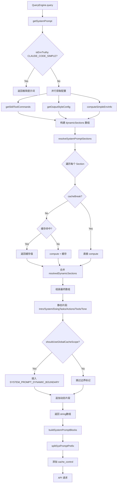
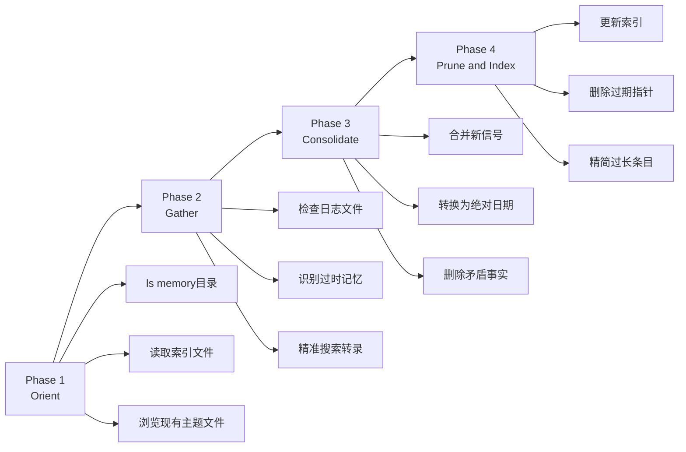
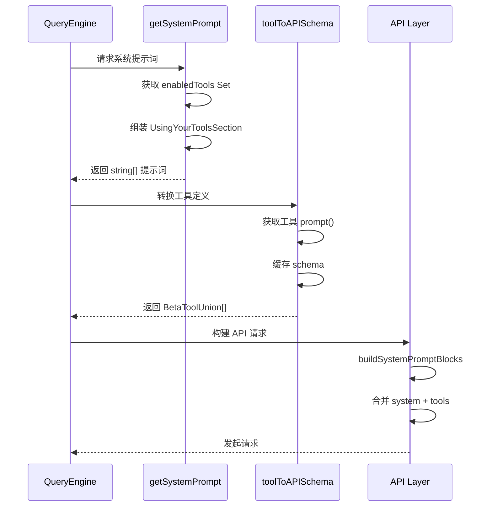
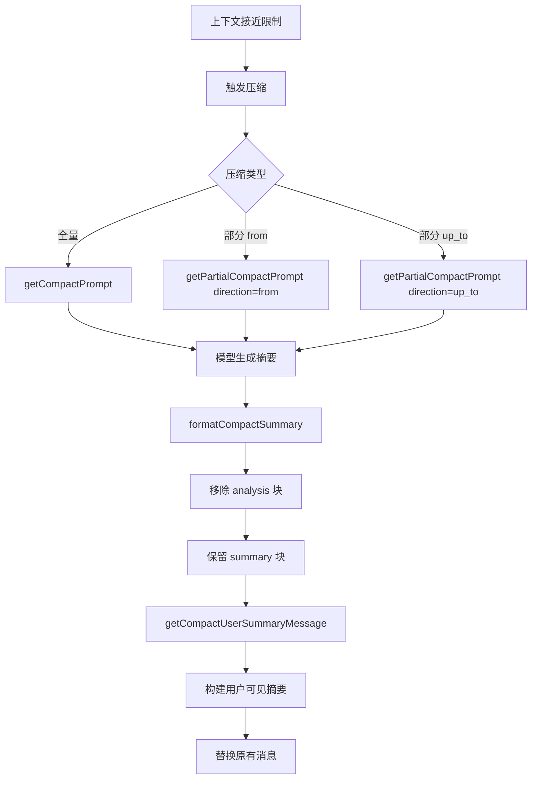

# 功能专题：提示词工程 (Prompt Engineering)

> 基于代码事实的功能分析文档

## 1. 概述

### 功能定位

提示词工程是 Claude Code 与 LLM 交互的核心层，负责将系统指令、工具定义、上下文信息组装成结构化的系统提示词，直接影响模型行为和响应质量。

### 设计原则

1. **模块化组装**：系统提示词由独立的功能片段（Section）按需组合，支持条件渲染和动态内容
2. **缓存友好**：静态内容与动态内容分离，静态部分可使用 `global` 缓存作用域实现跨组织复用
3. **懒加载**：通过 Beta Header 锁存机制，避免运行时频繁计算特性开关状态
4. **证据驱动**：每个提示词片段都有明确的触发条件和作用域，避免过度泛化

### 核心文件

| 文件路径 | 职责 |
|---------|------|
| `src/constants/prompts.ts` | 系统提示词主组装逻辑 |
| `src/constants/systemPromptSections.ts` | 片段缓存管理 |
| `src/services/compact/prompt.ts` | 压缩功能提示词 |
| `src/services/autoDream/consolidationPrompt.ts` | 整理功能提示词 |
| `src/utils/messages/systemInit.ts` | SDK 初始化消息构建 |
| `src/services/api/claude.ts:3209` | API 请求块构建 |

---

## 2. 设计原理

### 2.1 提示词组织策略

系统提示词采用分层结构：

```
+-------------------------------------------------------------+
| Attribution Header (无缓存)                                  |
+-------------------------------------------------------------+
| System Prompt Prefix (无缓存 / org缓存)                      |
+-------------------------------------------------------------+
| ######## 静态内容 (global 缓存) ########                     |
| - 角色定义 (Intro Section)                                   |
| - 工具使用指南 (Using Tools Section)                         |
| - 任务执行规范 (Doing Tasks Section)                         |
| - 输出风格 (Tone & Style Section)                            |
+-------------------------------------------------------------+
| SYSTEM_PROMPT_DYNAMIC_BOUNDARY                              |
+-------------------------------------------------------------+
| ........ 动态内容 (无缓存 / org缓存) ........                 |
| - Session 特定指导 (enabledTools, skillCommands)             |
| - 环境信息 (cwd, git status, model)                         |
| - MCP 服务器指令                                             |
| - 语言偏好设置                                               |
| - 输出风格配置                                               |
+-------------------------------------------------------------+
```

**关键设计决策**：

- **边界标记 `SYSTEM_PROMPT_DYNAMIC_BOUNDARY`**：明确的静态/动态分界点，边界前的内容可使用 `cacheScope: 'global'` 实现跨组织缓存复用
- **条件渲染**：每个 Section 通过函数计算返回 `string | null`，`null` 表示该片段不适用当前上下文
- **片段缓存**：通过 `systemPromptSection()` 创建的片段会被缓存至会话结束或 `/clear`、`/compact` 触发

### 2.2 缓存机制

#### 片段级缓存

```typescript
// src/constants/systemPromptSections.ts
export function systemPromptSection(name: string, compute: ComputeFn): SystemPromptSection {
  return { name, compute, cacheBreak: false }
}

export function DANGEROUS_uncachedSystemPromptSection(
  name: string, compute: ComputeFn, _reason: string
): SystemPromptSection {
  return { name, compute, cacheBreak: true }
}
```

**缓存生命周期**：
- 缓存存储于 `STATE.systemPromptSectionCache` (Map&lt;string, string | null&gt;)
- `cacheBreak: false` 的片段首次计算后缓存，后续请求直接返回缓存值
- `/clear` 或 `/compact` 命令触发 `clearSystemPromptSections()` 清空缓存

#### Beta Header 锁存

```typescript
// src/bootstrap/state.ts
export function getFastModeHeaderLatched(): boolean | null {
  return STATE.fastModeHeaderLatched
}
```

Beta Header（如 Fast Mode、AFK Mode、Cache Editing）的状态在会话开始时锁定，避免运行时 GrowthBook 特性开关变更导致提示词内容漂移，从而破坏缓存命中率。

#### 全局缓存作用域

```typescript
// src/utils/api.ts:321-349
export function splitSysPromptPrefix(
  systemPrompt: SystemPrompt,
  options?: { skipGlobalCacheForSystemPrompt?: boolean }
): SystemPromptBlock[]
```

**三种缓存策略**：

| 场景 | 缓存策略 | 说明 |
|------|----------|------|
| MCP 工具存在 | `skipGlobalCache=true` | 系统提示词使用 `org` 作用域 |
| 全局缓存模式 + 边界存在 | 静态 `global` + 动态无缓存 | 最优缓存效率 |
| 默认模式 | 全部 `org` 作用域 | 兼容第三方代理 |

---

## 3. 实现原理

### 3.1 提示词组装流程



### 3.2 核心函数解析

#### getSystemPrompt()

**位置**：`src/constants/prompts.ts:445`

**职责**：组装完整系统提示词数组

**关键逻辑**：

1. **极简模式快速路径**：`CLAUDE_CODE_SIMPLE` 环境变量触发，返回最小化提示词
2. **并行获取运行时配置**：`Promise.all` 并行获取 skill commands、output style、env info
3. **Proactive 模式特殊路径**：自主代理模式使用精简提示词
4. **构建动态片段**：通过 `systemPromptSection()` 注册可缓存片段
5. **解析所有片段**：`resolveSystemPromptSections()` 处理缓存逻辑
6. **组装最终数组**：静态片段 + 边界标记 + 动态片段

#### buildSystemPromptBlocks()

**位置**：`src/services/api/claude.ts:3209`

**职责**：将字符串数组转换为 API 请求格式，添加缓存控制

```typescript
export function buildSystemPromptBlocks(
  systemPrompt: SystemPrompt,
  enablePromptCaching: boolean,
  options?: { skipGlobalCacheForSystemPrompt?: boolean }
): TextBlockParam[] {
  return splitSysPromptPrefix(systemPrompt, options).map(block => ({
    type: 'text',
    text: block.text,
    ...(enablePromptCaching && block.cacheScope && {
      cache_control: getCacheControl({ scope: block.cacheScope })
    })
  }))
}
```

---

## 4. 功能展开

### 4.1 系统提示词片段

#### 角色定义 (Intro Section)

```typescript
function getSimpleIntroSection(outputStyleConfig: OutputStyleConfig | null): string {
  return `You are an interactive agent that helps users ${
    outputStyleConfig !== null 
      ? 'according to your "Output Style" below...' 
      : 'with software engineering tasks.'
  }`
}
```

**特点**：
- 根据 Output Style 配置动态调整角色描述
- 包含网络安全风险提示 (`CYBER_RISK_INSTRUCTION`)
- 禁止随意生成 URL

#### 任务执行规范 (Doing Tasks Section)

**位置**：`src/constants/prompts.ts:200-254`

**核心指导**：

| 类别 | 规范要点 |
|------|----------|
| 代码风格 | 不添加未请求的改进、不创建过早抽象、默认不写注释 |
| 错误处理 | 仅在边界验证、不过度防御性编程 |
| 安全意识 | 避免 OWASP Top 10 漏洞、发现即修复 |
| 任务管理 | 先读后改、避免文件膨胀、不过度估计时间 |
| Ant 专属 | 忠实报告结果、失败即说明、不制造绿色假象 |

#### 工具使用指南 (Using Tools Section)

**位置**：`src/constants/prompts.ts:270-315`

**核心原则**：

1. **优先专用工具**：`Read` > `cat`, `Edit` > `sed`, `Write` > `echo`
2. **并行调用**：独立操作同时发起，依赖操作顺序执行
3. **任务管理**：`TaskCreate`/`TodoWrite` 用于工作分解和进度跟踪

#### 输出效率 (Output Efficiency Section)

**Ant 模式** (`src/constants/prompts.ts:404-429`)：

- 写给人看，不是写给控制台
- 假设用户看不到工具调用和思考过程
- 关键节点更新：发现关键问题、方向变化、进展里程碑
- 流畅散文，避免表格堆砌
- 倒金字塔结构：先结论后推理

**外部模式**：

- 直接切入要点
- 一句话能说清的不用三句
- 聚焦：需要用户输入的决策、状态更新、错误和阻塞点

### 4.2 功能提示词库

#### 压缩提示词 (Compact Prompt)

**位置**：`src/services/compact/prompt.ts`

**三种变体**：

| 变体 | 函数 | 用途 |
|------|------|------|
| `BASE_COMPACT_PROMPT` | `getCompactPrompt()` | 全量压缩 |
| `PARTIAL_COMPACT_PROMPT` | `getPartialCompactPrompt(direction='from')` | 部分压缩（从最近消息开始） |
| `PARTIAL_COMPACT_UP_TO_PROMPT` | `getPartialCompactPrompt(direction='up_to')` | 压缩至某点（用于续接） |

**输出格式要求**：

```xml
<analysis>
[分析过程：按时间顺序梳理每个消息，提取关键信息]
</analysis>

<summary>
1. Primary Request and Intent:
2. Key Technical Concepts:
3. Files and Code Sections:
4. Errors and fixes:
5. Problem Solving:
6. All user messages:
7. Pending Tasks:
8. Current Work:
9. Optional Next Step:
</summary>
```

**关键设计**：

- **NO_TOOLS_PREAMBLE**：前置声明禁止工具调用，防止模型在单轮对话中尝试工具调用导致任务失败
- **分析块剥离**：`formatCompactSummary()` 移除 `<analysis>` 草稿，仅保留最终摘要

#### 整理提示词 (Consolidation Prompt)

**位置**：`src/services/autoDream/consolidationPrompt.ts`

**四阶段流程**：



**入口文件约束**：

- 最大行数：`MAX_ENTRYPOINT_LINES`
- 最大大小：~25KB
- 条目格式：`- [Title](file.md) — one-line hook` (~150 字符)

#### Agent 专属提示词

**Explore Agent** (`src/tools/AgentTool/built-in/exploreAgent.ts:13-57`)：

- 只读模式：禁止创建、修改、删除文件
- 专用搜索能力：glob 模式匹配、正则搜索、文件内容分析
- 快速返回：并行调用工具

**Plan Agent** (`src/tools/AgentTool/built-in/planAgent.ts`)：

- 读取代码理解现状
- 创建详细实现计划
- 输出 Markdown 格式计划文档

### 4.3 SDK 初始化消息

**位置**：`src/utils/messages/systemInit.ts`

**职责**：构建 `system/init` SDK 消息，供远程客户端渲染 UI

**消息结构**：

```typescript
interface SDKMessage {
  type: 'system'
  subtype: 'init'
  cwd: string
  session_id: string
  tools: string[]
  mcp_servers: { name: string; status: string }[]
  model: string
  permissionMode: PermissionMode
  slash_commands: string[]
  apiKeySource: ApiKeySource
  betas: string[]
  claude_code_version: string
  output_style: string
  agents: string[]
  skills: string[]
  plugins: { name: string; path: string; source: string }[]
  uuid: string
  fast_mode_state?: FastModeState
}
```

**关键设计**：

- **工具名兼容**：`sdkCompatToolName()` 将 `Agent` 转换为 `Task`（SDK 消费者兼容性）
- **用户可调用过滤**：`userInvocable !== false` 过滤内部命令
- **UDS Socket Path**：`feature('UDS_INBOX')` 时追加消息管道路径

---

## 5. 核心数据结构

### 5.1 Prompt 片段接口

```typescript
// src/constants/systemPromptSections.ts
type ComputeFn = () => string | null | Promise<string | null>

type SystemPromptSection = {
  name: string          // 片段标识符，用于缓存键
  compute: ComputeFn    // 计算函数，返回片段内容或 null
  cacheBreak: boolean   // true = 每次重新计算，false = 缓存
}
```

### 5.2 缓存配置

```typescript
// src/utils/api.ts
export type CacheScope = 'global' | 'org'

export type SystemPromptBlock = {
  text: string
  cacheScope: CacheScope | null
}

// 缓存控制
type CacheControl = {
  type: 'ephemeral'
  scope?: 'global' | 'org'
  ttl?: '5m' | '1h'
}
```

### 5.3 系统提示词类型

```typescript
// src/utils/systemPromptType.ts
export type SystemPrompt = string[]

export function asSystemPrompt(parts: string[]): SystemPrompt {
  return parts.filter(p => p !== null && p !== undefined)
}
```

### 5.4 Beta Header 锁存状态

```typescript
// src/bootstrap/state.ts (STATE 结构)
{
  systemPromptSectionCache: Map<string, string | null>
  promptCache1hAllowlist: string[] | null
  promptCache1hEligible: boolean | null
  afkModeHeaderLatched: boolean | null
  fastModeHeaderLatched: boolean | null
  cacheEditingHeaderLatched: boolean | null
  thinkingClearLatched: boolean | null
}
```

---

## 6. 组合使用

### 6.1 与工具系统的协作



**关键协作点**：

1. **工具可用性感知**：`getSystemPrompt()` 接收 `tools: Tools` 参数，根据工具集合动态调整指导内容
2. **工具提示词缓存**：`toolToAPISchema()` 使用 `toolSchemaCache` 缓存工具描述，避免重复计算
3. **并行处理**：系统提示词和工具定义可并行准备，最后在 API 层合并

### 6.2 与上下文管理的协作

**上下文压缩流程**：



**关键协作点**：

1. **触发时机**：`QueryEngine` 检测上下文使用率，自动触发压缩
2. **提示词选择**：根据压缩方向（from/up_to）选择对应提示词变体
3. **格式化输出**：`formatCompactSummary()` 清理模型输出，提取结构化摘要

### 6.3 与 MCP 系统的协作

**MCP 指令注入**：

```typescript
// src/constants/prompts.ts:161-166
function getMcpInstructionsSection(mcpClients: MCPServerConnection[]): string | null {
  if (!mcpClients || mcpClients.length === 0) return null
  return getMcpInstructions(mcpClients)
}

// src/constants/prompts.ts:580-605
function getMcpInstructions(mcpClients: MCPServerConnection[]): string | null {
  const connectedClients = mcpClients.filter(c => c.type === 'connected')
  const clientsWithInstructions = connectedClients.filter(c => c.instructions)
  
  if (clientsWithInstructions.length === 0) return null
  
  return `# MCP Server Instructions

The following MCP servers have provided instructions:
${clientsWithInstructions.map(c => `## ${c.name}\n${c.instructions}`).join('\n\n')}`
}
```

**缓存影响**：

- MCP 指令位于动态部分，使用 `DANGEROUS_uncachedSystemPromptSection`
- MCP 连接/断开会触发 `skipGlobalCacheForSystemPrompt=true`，降级到 `org` 缓存作用域

---

## 7. 小结

### 设计优势

1. **高效缓存利用**：静态/动态分离 + 片段级缓存 + 全局作用域，最大化缓存命中率
2. **灵活的条件渲染**：每个片段独立计算，根据上下文动态调整内容
3. **功能隔离**：压缩、整理、Agent 提示词独立维护，各司其职
4. **SDK 兼容性**：`systemInit` 消息提供完整会话元数据，支持远程客户端

### 局限性

1. **缓存复杂度**：三种缓存策略（global/org/无缓存）增加了理解和调试难度
2. **Beta Header 锁存**：会话级锁定意味着中途无法切换特性开关
3. **MCP 动态性**：MCP 连接状态变化会破坏全局缓存，需要降级处理

### 演进方向

1. **1h TTL 缓存**：`promptCache1hEligible` 和 `promptCache1hAllowlist` 支持更长时间的缓存
2. **Delta 更新**：`isMcpInstructionsDeltaEnabled()` 支持增量更新 MCP 指令，避免全量重建
3. **Token Budget**：`TOKEN_BUDGET` 特性支持用户指定 token 目标，系统自动持续工作

---

## 附录：代码证据索引

| 概念 | 文件位置 |
|------|----------|
| 系统提示词主入口 | `src/constants/prompts.ts:445` |
| 片段缓存管理 | `src/constants/systemPromptSections.ts:20-38` |
| 缓存状态存储 | `src/bootstrap/state.ts:1641-1654` |
| API 块构建 | `src/services/api/claude.ts:3209-3233` |
| 缓存作用域分割 | `src/utils/api.ts:321-349` |
| 压缩提示词 | `src/services/compact/prompt.ts:274-374` |
| 整理提示词 | `src/services/autoDream/consolidationPrompt.ts:10-65` |
| SDK 初始化消息 | `src/utils/messages/systemInit.ts:53-96` |
| Explore Agent 提示词 | `src/tools/AgentTool/built-in/exploreAgent.ts:13-57` |
| 动态边界标记 | `src/constants/prompts.ts:115-116` |
