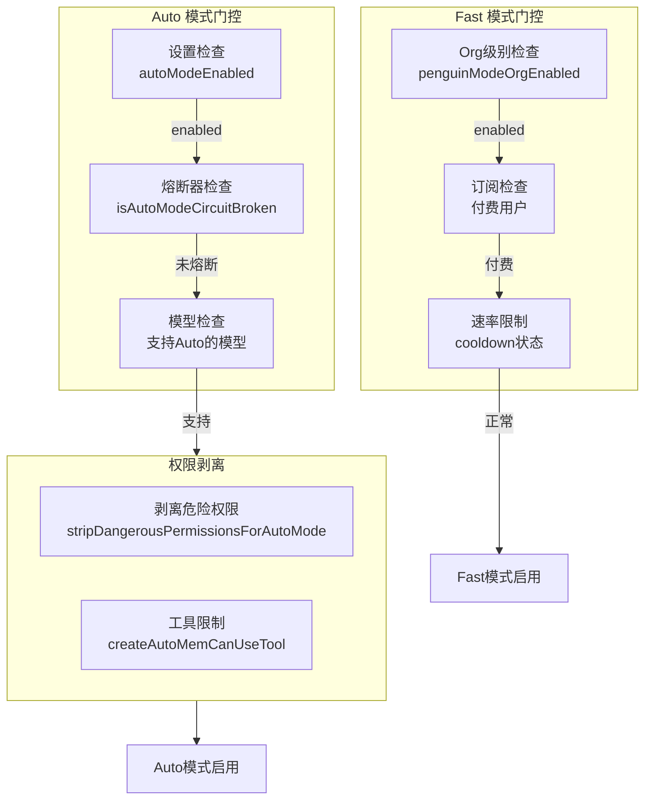
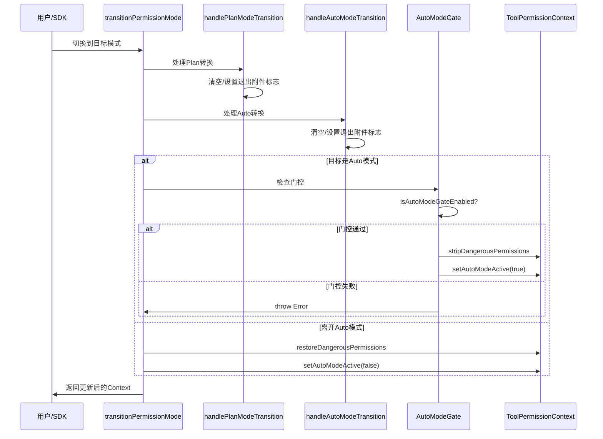

# 49. 自动模式与计划模式 (Auto & Plan Modes)

> **代码入口**: `src/utils/planModeV2.ts`, `src/utils/permissions/autoModeState.ts`, `src/services/autoDream/autoDream.ts`
> **核心功能**: 四种运行模式管理、模式转换、自动整理、安全控制

## 概述

Claude Code 提供四种运行模式，覆盖从严格交互到完全自治的不同使用场景：

| 模式 | 决策权 | 适用场景 | 安全级别 |
|------|--------|----------|----------|
| **Default** | 用户确认每个操作 | 日常开发、敏感环境 | 最高 |
| **Plan** | 只读分析，禁止写入 | 架构审计、代码分析 | 高 |
| **Auto** | AI 自主决策执行 | 重复任务、CI/CD | 中 |
| **Fast** | 快速响应，优化延迟 | 流式交互、低延迟场景 | 中 |

**设计理念**：
- **渐进式自治**：从 Default → Plan → Auto → Fast，自治程度递增
- **安全优先**：模式切换需权限检查，Auto 模式有熔断机制
- **透明可控**：模式状态全局可见，切换有附件通知

## 设计原理

### 模式切换策略

```mermaid
stateDiagram-v2
    [*] --> Default: 启动
    
    Default --> Plan: EnterPlanModeTool
    Plan --> Default: ExitPlanModeTool
    
    Default --> Auto: Shift+Tab / CLI
    Auto --> Default: Shift+Tab / 熔断
    
    Default --> Fast: 设置启用
    Fast --> Default: 设置关闭 / 过载
    
    Plan --> PlanAuto: Plan中启用Auto
    PlanAuto --> Plan: Auto禁用
    
    note right of Plan
        只读模式
        禁止所有写入操作
    end note
    
    note right of Auto
        自主模式
        需权限检查+熔断器
    end note
    
    note right of Fast
        快速模式
        需付费订阅+Org支持
    end note
```

**转换规则**：
1. **Plan 模式入口**：清空退出附件标志，禁止写入工具
2. **Auto 模式入口**：检查门控权限，剥离危险权限规则
3. **Fast 模式入口**：检查 Org 级别支持，可能触发冷却
4. **模式退出**：恢复原权限规则，触发退出附件

### 安全控制机制



**代码证据**：
- 门控检查：`src/utils/permissions/permissionSetup.ts:627-637`
- 权限剥离：`src/utils/permissions/permissionSetup.ts:632`
- 熔断器：`src/utils/permissions/autoModeState.ts:9, 27-32`

## 实现原理

### 1. 模式类型定义

**代码路径**：`src/types/permissions.ts:16-39`

```typescript
// 外部可访问的模式（SDK/外部API）
export const EXTERNAL_PERMISSION_MODES = [
  'acceptEdits',
  'bypassPermissions', 
  'default',
  'dontAsk',
  'plan',
] as const

// 内部完整模式集合
export type InternalPermissionMode = 
  | ExternalPermissionMode 
  | 'auto'    // Ant-only，需 TRANSCRIPT_CLASSIFIER feature
  | 'bubble'  // 内部使用

export const INTERNAL_PERMISSION_MODES = [
  ...EXTERNAL_PERMISSION_MODES,
  ...(feature('TRANSCRIPT_CLASSIFIER') ? ['auto'] : []),
]
```

**设计决策**：
- `auto` 模式仅限内部用户（ant），需 feature flag 启用
- 模式枚举分离内外，保证 API 兼容性

### 2. 模式转换管理

**代码路径**：`src/utils/permissions/permissionSetup.ts:597-646`

核心转换函数 `transitionPermissionMode` 负责处理所有模式切换的副作用。

**转换流程**：



### 3. Auto 模式安全控制

#### 3.1 熔断机制

**代码路径**：`src/utils/permissions/autoModeState.ts:1-39`

熔断器是 Auto 模式的安全网，当 GrowthBook 配置禁用或 API 返回不可用时，阻止 Auto 模式激活。

**熔断触发场景**：
- GrowthBook 配置 `tengu_auto_mode_config.enabled === 'disabled'`
- API 返回 auto mode 不可用
- 连续决策错误超过阈值（潜在扩展点）

#### 3.2 权限剥离

**代码路径**：`src/utils/permissions/permissionSetup.ts:632`

进入 Auto 模式时，剥离危险权限规则，防止 AI 自主执行高风险操作。

剥离逻辑：
- 移除 `bypassPermissions` 相关规则
- 保留只读和低风险操作规则
- 设置 `strippedDangerousRules` 字段记录被剥离的规则

### 4. Kairos 状态控制

**代码路径**：`src/bootstrap/state.ts:72, 1085-1091`

Kairos 是 Ant-only 的助手模式，优先级高于 Auto。

**Kairos 与模式的关系**：
- Kairos 激活时，Auto Dream 使用不同的 dream 机制（disk-skill dream）
- Fast 模式对 Kairos 豁免 SDK 限制

**代码证据**：`src/services/autoDream/autoDream.ts:97`

### 5. Fast 模式冷却机制

**代码路径**：`src/utils/fastMode.ts:183-237`

Fast 模式使用运行时状态机管理冷却：

```typescript
export type FastModeRuntimeState =
  | { status: 'active' }
  | { status: 'cooldown'; resetAt: number; reason: CooldownReason }
```

**冷却触发条件**：
- API 返回 429 Rate Limit
- API 返回 overloaded 错误
- Overage 计费不可用

### 6. Auto Dream 自动整理

**代码路径**：`src/services/autoDream/autoDream.ts:96-191`

三重门控检查：
1. **时间门控**：`hoursSince >= minHours` (默认 24h)
2. **会话门控**：`sessionIds.length >= minSessions` (默认 5)
3. **锁门控**：`tryAcquireConsolidationLock()`

## 功能展开

### 49.1 模式定义

**Default 模式**：
- 每个非安全操作都需要用户确认
- 适用于敏感环境、首次使用

**Plan 模式**：
- 只读分析，禁止所有写入操作
- 适用于代码审计、架构分析
- 支持 interview phase（Ant-only）

**Auto 模式**：
- AI 自主决策，自动执行操作
- 需 TRANSCRIPT_CLASSIFIER feature
- 受熔断器保护

**Fast 模式**：
- 优化响应延迟，使用 Opus 4.6
- 需要付费订阅和 Org 支持
- 受速率限制冷却

### 49.2 Plan Mode V2 配置

**代码路径**：`src/utils/planModeV2.ts:5-43`

Agent 数量由订阅类型决定：
- Max/Enterprise/Team: 3 agents
- 其他: 1 agent

Interview phase 通过 `tengu_plan_mode_interview_phase` feature flag 控制。

### 49.3 转换管理

**Plan 模式转换**：`src/bootstrap/state.ts:1349-1363`
- 切换到 Plan：清空退出附件
- 离开 Plan：触发退出附件

**Auto 模式转换**：`src/bootstrap/state.ts:1373-1399`
- 跳过 Auto↔Plan 直接转换
- 切换到 Auto：清空退出附件
- 离开 Auto：触发退出附件

### 49.4 Auto Dream 整理

**四阶段整理流程**：
1. **Orient**：读取现有记忆结构
2. **Gather**：收集新信号（日志、转录）
3. **Consolidate**：整合到记忆文件
4. **Prune**：修剪并更新入口索引

## 核心数据结构

### PermissionMode 类型

```typescript
// src/types/permissions.ts
export type PermissionMode = InternalPermissionMode

export type InternalPermissionMode = 
  | ExternalPermissionMode 
  | 'auto' 
  | 'bubble'

export type ExternalPermissionMode = 
  | 'acceptEdits'
  | 'bypassPermissions'
  | 'default'
  | 'dontAsk'
  | 'plan'
```

### 模式状态

```typescript
// src/bootstrap/state.ts
type State = {
  kairosActive: boolean           // Kairos 助手模式
  hasExitedPlanMode: boolean      // 是否退出过 Plan 模式
  needsPlanModeExitAttachment: boolean   // Plan 退出附件标志
  needsAutoModeExitAttachment: boolean   // Auto 退出附件标志
  afkModeHeaderLatched: boolean | null   // Auto 模式 header 锁存
  fastModeHeaderLatched: boolean | null  // Fast 模式 header 锁存
}

// src/utils/permissions/autoModeState.ts
let autoModeActive: boolean       // Auto 模式激活
let autoModeCircuitBroken: boolean  // 熔断标志

// src/utils/fastMode.ts
type FastModeRuntimeState =
  | { status: 'active' }
  | { status: 'cooldown'; resetAt: number; reason: CooldownReason }
```

### ToolPermissionContext

```typescript
// src/types/permissions.ts
export type ToolPermissionContext = {
  readonly mode: PermissionMode
  readonly prePlanMode?: PermissionMode  // Plan 模式前的模式
  readonly strippedDangerousRules?: ToolPermissionRulesBySource
  readonly shouldAvoidPermissionPrompts?: boolean
}
```

## 组合使用

### 与会话管理的协作

- 模式状态存储在全局 `STATE` 中，跨对话持久化
- 会话恢复时恢复模式状态

### 与权限系统的协作

- Auto 模式进入时剥离危险权限
- Plan 模式禁止写入工具

### 与 Analytics 的协作

- 模式切换记录到 `tengu_auto_mode_decision` 事件
- Kairos 状态标记 `kairosActive: true`

## 小结

### 设计取舍

**优势**：
1. 四种模式覆盖从严格到自治的完整光谱
2. 熔断机制提供安全网，防止误用
3. 模式转换集中管理，保证一致性

**局限**：
1. Auto 模式仅限 Ant 用户，外部用户无法使用
2. Fast 模式依赖 Org 配置，部署复杂
3. Kairos 与 Auto 的交互逻辑分散多处

### 演进方向

1. 智能模式推荐：基于任务类型自动建议模式
2. 细粒度权限控制：Auto 模式支持自定义危险操作列表
3. 统一模式状态机：将 Kairos/Fast 纳入统一框架

---

**相关文档**：
- [[15-permissions]] - 权限系统
- [[32-auto-dream]] - 自动整理
- [[10-session-state]] - 会话状态

**代码索引**：
- `src/types/permissions.ts:16-39` - 模式类型定义
- `src/utils/permissions/permissionSetup.ts:597-646` - 模式转换
- `src/utils/permissions/autoModeState.ts:1-39` - 熔断机制
- `src/utils/fastMode.ts:183-237` - Fast 模式冷却
- `src/bootstrap/state.ts:1349-1399` - 转换处理函数
