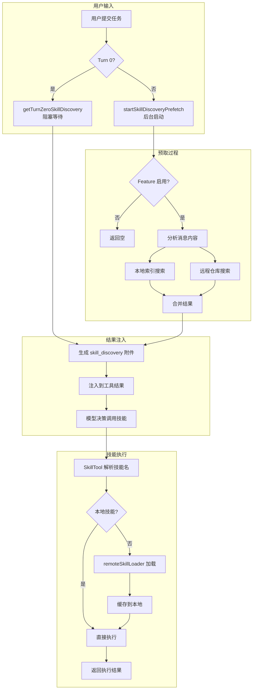

# 技能搜索系统 (Skill Search)

> **代码入口**: `src/services/skillSearch/`, `src/tools/DiscoverSkillsTool/`
> **Feature Flag**: `EXPERIMENTAL_SKILL_SEARCH`
> **实现状态**: 全部 Stub（8 个文件），布线完整
> **Graphify Community**: Community 2 (392 nodes, cohesion 0.01) — Plugin 系统主社区

---

## 1. 概述

技能搜索系统是一个**实验性功能**，旨在根据用户任务的语义自动发现和推荐相关技能。其设计目标是：

1. **语义搜索**：根据任务描述匹配可用技能，而非依赖用户手动查找
2. **混合搜索**：本地索引快速匹配 + 远程市场深度搜索
3. **预取优化**：在用户提交前启动搜索，减少首次响应延迟
4. **无缝集成**：发现的技能通过现有 SkillTool 调用，无需新机制

**重要状态**：当前所有模块均为 Stub 实现，仅布线完整。Feature Flag 默认关闭，系统返回空结果。

---

## 2. 设计原理

### 2.1 远程/本地搜索分离

系统设计为双路径搜索架构：

```
┌─────────────────────────────────────────────────────────────┐
│                    用户任务上下文                            │
└─────────────────────────────────────────────────────────────┘
                            │
                            ▼
┌─────────────────────────────────────────────────────────────┐
│                  DiscoverSkills 工具触发                     │
│              (src/tools/DiscoverSkillsTool/prompt.ts)        │
└─────────────────────────────────────────────────────────────┘
                            │
            ┌───────────────┴───────────────┐
            ▼                               ▼
┌───────────────────────┐       ┌───────────────────────┐
│     本地索引搜索       │       │     远程仓库搜索       │
│  (localSearch.ts)     │       │ (remoteSkillLoader.ts) │
├───────────────────────┤       ├───────────────────────┤
│ • 已安装技能元数据     │       │ • 技能市场/注册表      │
│ • 本地 Skill 命令      │       │ • 远程技能仓库         │
│ • MCP 服务器技能       │       │ • 插件市场技能         │
│ • 快速全文匹配         │       │ • 语义相似度排序       │
└───────────────────────┘       └───────────────────────┘
            │                               │
            └───────────────┬───────────────┘
                            ▼
┌─────────────────────────────────────────────────────────────┐
│                   结果合并与排序                             │
│              (telemetry.ts 记录搜索指标)                     │
└─────────────────────────────────────────────────────────────┘
                            │
                            ▼
┌─────────────────────────────────────────────────────────────┐
│                 返回推荐技能列表                             │
│            → SkillTool 执行技能调用                          │
└─────────────────────────────────────────────────────────────┘
```

**设计动机**：
- 本地搜索保证低延迟（无需网络请求）
- 远程搜索扩展技能范围（用户未安装的技能）
- 分离实现允许独立演进和 A/B 测试

### 2.2 预加载策略

预取机制在用户输入过程中提前启动搜索：

```
时间线：
───────────────────────────────────────────────────────────────▶
    │                    │                    │
    ▼                    ▼                    ▼
用户开始输入         模型开始处理          工具执行完成
    │                    │                    │
    ▼                    │                    │
startSkillDiscoveryPrefetch()                 │
    │                    │                    │
    │ 异步执行            │                    │
    ▼                    ▼                    ▼
    └─────────────▶ collectSkillDiscoveryPrefetch()
                         │
                         ▼
                    注入 skill_discovery 附件
```

**关键设计**：
- Turn-0 用户输入发现阻塞等待（`getTurnZeroSkillDiscovery`）
- 后续轮次在后台预取，工具执行后收集
- 预取结果与主流程并行，不影响响应延迟

---

## 3. 实现原理

### 3.1 模块状态总览

| 模块 | 文件 | 状态 | 当前实现 |
|------|------|------|----------|
| DiscoverSkillsTool | `src/tools/DiscoverSkillsTool/prompt.ts` | **Stub** | 空工具名 `''` |
| 预取 | `src/services/skillSearch/prefetch.ts` | **Stub** | 3 函数返回空 |
| 远程加载 | `src/services/skillSearch/remoteSkillLoader.ts` | **Stub** | 返回空 Promise |
| 远程状态 | `src/services/skillSearch/remoteSkillState.ts` | **Stub** | 返回 null/undefined |
| 信号类型 | `src/services/skillSearch/signals.ts` | **Stub** | `DiscoverySignal = any` |
| 遥测 | `src/services/skillSearch/telemetry.ts` | **Stub** | 空操作 |
| 本地搜索 | `src/services/skillSearch/localSearch.ts` | **Stub** | 空操作 |
| 功能检查 | `src/services/skillSearch/featureCheck.ts` | **Stub** | `isSkillSearchEnabled() => false` |

### 3.2 搜索流程（设计预期）



### 3.3 当前布线路径

尽管实现为 Stub，系统布线完整：

**1. Feature Flag 入口** (`src/constants/prompts.ts:87-98`)
```typescript
const DISCOVER_SKILLS_TOOL_NAME: string | null = feature('EXPERIMENTAL_SKILL_SEARCH')
  ? require('../tools/DiscoverSkillsTool/prompt.js').DISCOVER_SKILLS_TOOL_NAME
  : null

const skillSearchFeatureCheck = feature('EXPERIMENTAL_SKILL_SEARCH')
  ? require('../services/skillSearch/featureCheck.js')
  : null
```

**2. 预取集成点** (`src/utils/attachments.ts:95-102`)
```typescript
const skillSearchModules = feature('EXPERIMENTAL_SKILL_SEARCH')
  ? {
      featureCheck: require('../services/skillSearch/featureCheck.js'),
      prefetch: require('../services/skillSearch/prefetch.js'),
    }
  : null
```

**3. Query 循环集成** (`src/query.ts:331-335, 1620-1631`)
```typescript
const pendingSkillPrefetch = skillPrefetch?.startSkillDiscoveryPrefetch(
  null,
  messages,
  toolUseContext,
)

// 后续收集
if (skillPrefetch && pendingSkillPrefetch) {
  const skillAttachments = await skillPrefetch.collectSkillDiscoveryPrefetch(pendingSkillPrefetch)
  // 注入到工具结果
}
```

---

## 4. 功能展开

### 4.1 远程技能搜索

**预期功能**：
- 连接技能市场/注册表
- 获取远程技能元数据
- 语义相似度排序
- 结果缓存优化

**当前 Stub 实现** (`remoteSkillLoader.ts`):
```typescript
export function loadRemoteSkill(_slug: string, _url: string): Promise<{
  cacheHit: boolean;
  latencyMs: number;
  skillPath: string;
  content: string;
  fileCount?: number;
  totalBytes?: number;
  fetchMethod?: string;
}> {
  return Promise.resolve({
    cacheHit: false,
    latencyMs: 0,
    skillPath: '',
    content: '',
  });
}
```

**待实现**：
1. 远程技能仓库协议（HTTP API / Git）
2. 技能元数据 Schema 定义
3. 语义相似度计算算法
4. 缓存失效策略

### 4.2 本地索引搜索

**预期功能**：
- 已安装技能全文索引
- 名称/描述/关键字匹配
- 索引增量更新
- MCP 技能同步

**当前 Stub 实现** (`localSearch.ts`):
```typescript
export const clearSkillIndexCache: () => void = () => {};
```

**数据来源**（`src/utils/attachments.ts:2676-2684`）:
```typescript
const localCommands = await getSkillToolCommands(cwd)
const mcpSkills = getMcpSkillCommands(
  toolUseContext.getAppState().mcp.commands,
)
```

**待实现**：
1. 倒排索引构建
2. TF-IDF / BM25 排序
3. 索引持久化
4. MCP 技能变更监听

### 4.3 预加载与状态管理

**预期功能**：
- 用户输入分析
- 后台预取调度
- 远程技能状态追踪
- 特性开关控制

**当前 Stub 实现** (`prefetch.ts`):
```typescript
export const startSkillDiscoveryPrefetch = async () => [];
export const collectSkillDiscoveryPrefetch = async (pending) => pending;
export const getTurnZeroSkillDiscovery = async () => null;
```

**状态管理** (`remoteSkillState.ts`):
```typescript
export function stripCanonicalPrefix(_name: string): string | null { return null; }
export function getDiscoveredRemoteSkill(_slug: string): { url: string } | undefined { 
  return undefined; 
}
```

**特性检查** (`featureCheck.ts`):
```typescript
export const isSkillSearchEnabled: () => boolean = () => false;
```

---

## 5. 核心数据结构

### 5.1 Attachment 类型定义

**skill_discovery 附件** (`src/utils/attachments.ts:537-542`):
```typescript
{
  type: 'skill_discovery'
  skills: { name: string; description: string; shortId?: string }[]
  signal: DiscoverySignal
  source: 'native' | 'aki' | 'both'
}
```

**skill_listing 附件** (`src/utils/attachments.ts:531-536`):
```typescript
{
  type: 'skill_listing'
  content: string
  skillCount: number
  isInitial: boolean
}
```

### 5.2 信号类型

**DiscoverySignal** (`src/services/skillSearch/signals.ts`):
```typescript
export type DiscoverySignal = any;  // Stub - 待定义具体类型
```

**预期信号类型**：
- `user_input` - 用户输入触发
- `assistant_turn` - 助手轮次触发
- `subagent_spawn` - 子代理启动触发

### 5.3 遥测数据

**搜索遥测** (`src/services/skillSearch/telemetry.ts`):
```typescript
export function logRemoteSkillLoaded(data: {
  slug: string;
  cacheHit: boolean;
  latencyMs: number;
  urlScheme: string;
  error?: string;
  fileCount?: number;
  totalBytes?: number;
  fetchMethod?: string;
}): void {}
```

---

## 6. 组合使用

### 6.1 与 Plugin 系统协作

技能搜索与 Plugin 系统共享 Community 2 节点：

```
Plugin 系统                 技能搜索系统
    │                           │
    ▼                           ▼
marketplaceManager.ts    remoteSkillLoader.ts
    │                           │
    ├── 技能市场配置 ◄─────────┤
    ├── 插件安装状态            │
    └── 本地技能命令            ├── 远程技能发现
                                └── 技能推荐排序
```

**协作点**：
- `marketplaceManager` 提供市场配置源
- `installedPluginsManager` 提供已安装技能列表
- `pluginLoader` 加载的技能纳入本地索引

### 6.2 与 SkillTool 集成

发现的技能通过 SkillTool 执行：

```
skill_discovery 附件
        │
        ▼
模型选择技能 (skill name)
        │
        ▼
SkillTool.matchingSkillForInput()
        │
        ├── 本地技能 → 直接执行
        │
        └── 远程技能 → loadRemoteSkill() → 缓存 → 执行
```

### 6.3 技能列表过滤策略

当技能搜索启用时，系统采用**过滤策略**减少 Turn-0 数据量 (`src/utils/attachments.ts:2652-2698`):

```typescript
// 过滤到 bundled + MCP，而非全量
if (feature('EXPERIMENTAL_SKILL_SEARCH') && 
    skillSearchModules?.featureCheck.isSkillSearchEnabled()) {
  allCommands = filterToBundledAndMcp(allCommands)
}
```

**过滤逻辑**：
- Bundled（Anthropic 官方技能）+ MCP（用户连接的服务器技能）优先
- User/Project/Plugin 技能（长尾 200+）走发现路径
- 保护 MCP-heavy 用户免于截断

---

## 7. 小结

### 7.1 当前状态

技能搜索系统是一个**布线完整但实现空缺**的实验性功能：

| 方面 | 状态 |
|------|------|
| 模块结构 | ✅ 完整（8 个文件） |
| Feature Flag | ✅ 已配置 |
| 集成点 | ✅ 布线完整 |
| 核心逻辑 | ❌ 全部 Stub |
| 测试覆盖 | ❌ 待实现 |

### 7.2 设计取舍

**优点**：
- 预取机制隐藏延迟
- 双路径搜索覆盖本地+远程
- 与现有 SkillTool 无缝集成
- Feature Flag 安全隔离

**局限**：
- 需要实现完整的语义搜索算法
- 远程仓库协议待定义
- 索引构建有性能开销
- MCP 技能变更需同步

### 7.3 演进方向

1. **短期**：实现 DiscoverSkillsTool schema 和基础执行逻辑
2. **中期**：完成本地索引搜索和预取机制
3. **长期**：接入技能市场，实现语义相似度排序

---

## 附录：文件索引

| 文件 | 职责 | 行数 |
|------|------|------|
| `src/services/skillSearch/prefetch.ts` | 预取逻辑（stub） | 18 |
| `src/services/skillSearch/remoteSkillLoader.ts` | 远程加载（stub） | 17 |
| `src/services/skillSearch/remoteSkillState.ts` | 远程状态（stub） | 3 |
| `src/services/skillSearch/signals.ts` | 信号类型（stub） | 2 |
| `src/services/skillSearch/telemetry.ts` | 遥测（stub） | 11 |
| `src/services/skillSearch/localSearch.ts` | 本地搜索（stub） | 3 |
| `src/services/skillSearch/featureCheck.ts` | 功能检查（stub） | 3 |
| `src/tools/DiscoverSkillsTool/prompt.ts` | 工具 schema（stub） | 3 |
| `src/utils/attachments.ts` | 预取集成点 | ~60 行相关 |
| `src/query.ts` | Query 循环集成 | ~20 行相关 |
| `src/constants/prompts.ts` | Feature Flag 入口 | ~15 行相关 |

---

*生成时间: 2026-04-26*
*代码证据: graphify-out/wiki/Community_2.md, docs/features/experimental-skill-search.md*
