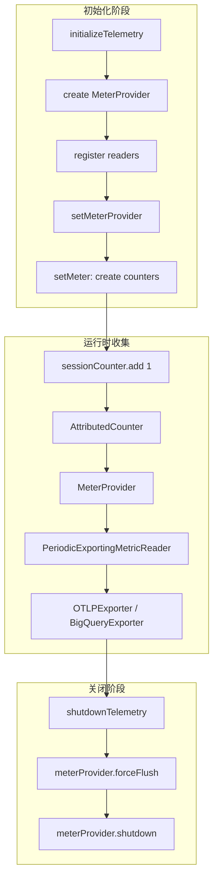
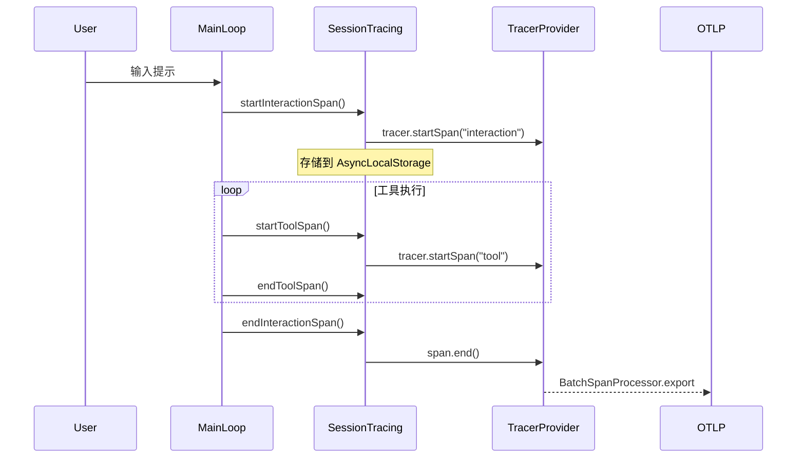
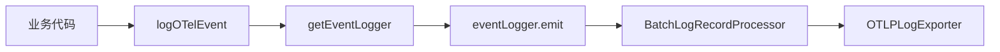

# 可观测性系统 (Observability)

> OpenTelemetry 三支柱实现：指标收集、分布式追踪、结构化日志

## 概述

Claude Code 的可观测性系统基于 OpenTelemetry 标准实现，完整覆盖可观测性三大支柱：

| 支柱 | 组件 | 数据流向 |
|------|------|----------|
| **Metrics** | MeterProvider | Counter → PeriodicExportingMetricReader → OTLP/Console/BigQuery |
| **Traces** | TracerProvider | Span → BatchSpanProcessor → OTLP/Console |
| **Logs** | LoggerProvider | LogRecord → BatchLogRecordProcessor → OTLP/Console |

**设计目标**：
- 统一遥测数据出口，支持多种后端（OTLP、Console、BigQuery）
- 与会话生命周期绑定，确保数据完整导出
- 支持内部用户 (ant) 的深度监控与外部用户的基础遥测

## 设计原理

### OpenTelemetry Provider 分离架构

```
┌─────────────────────────────────────────────────────────────────┐
│                     initializeTelemetry()                        │
│                   instrumentation.ts:421                         │
└─────────────────────────────────────────────────────────────────┘
                                │
        ┌───────────────────────┼───────────────────────┐
        ▼                       ▼                       ▼
┌───────────────┐       ┌───────────────┐       ┌───────────────┐
│ MeterProvider │       │LoggerProvider │       │TracerProvider │
│  (always)     │       │ (if enabled)  │       │ (beta only)   │
└───────────────┘       └───────────────┘       └───────────────┘
        │                       │                       │
        ▼                       ▼                       ▼
┌───────────────┐       ┌───────────────┐       ┌───────────────┐
│  Counters     │       │ EventLogger   │       │    Spans      │
│  - session    │       │  emit()       │       │  interaction  │
│  - loc        │       └───────────────┘       │  llm_request  │
│  - token      │                               │  tool         │
│  - cost       │                               └───────────────┘
│  - activeTime │
└───────────────┘
```

### Provider 生命周期管理

Provider 实例存储于 `src/bootstrap/state.ts`，通过 getter/setter 全局访问：

```typescript
// state.ts:104-109
loggerProvider: LoggerProvider | null
meterProvider: MeterProvider | null
tracerProvider: BasicTracerProvider | null
```

**关键函数**：
- `setMeterProvider()` / `getMeterProvider()` — state.ts:1043-1047
- `setLoggerProvider()` / `getLoggerProvider()` — state.ts:1025-1031
- `setTracerProvider()` / `getTracerProvider()` — state.ts:1050-1053

### 配置驱动

环境变量控制各信号的导出器类型：

```bash
OTEL_METRICS_EXPORTER=otlp     # otlp | console | prometheus | none
OTEL_LOGS_EXPORTER=otlp        # otlp | console | none
OTEL_TRACES_EXPORTER=otlp      # otlp | console | none
OTEL_EXPORTER_OTLP_PROTOCOL=http/protobuf  # grpc | http/json | http/protobuf
```

## 实现原理

### 指标收集流程



**核心 Counter 定义** (state.ts:955-986)：

| Counter | 名称 | 单位 | 描述 |
|---------|------|------|------|
| sessionCounter | `claude_code.session.count` | - | CLI 会话计数 |
| locCounter | `claude_code.lines_of_code.count` | - | 代码行变更 |
| costCounter | `claude_code.cost.usage` | USD | 会话成本 |
| tokenCounter | `claude_code.token.usage` | tokens | Token 使用量 |
| activeTimeCounter | `claude_code.active_time.total` | s | 活跃时间 |

### 分布式追踪流程



**追踪类型** (sessionTracing.ts:49-55)：

```typescript
type SpanType =
  | 'interaction'      // 用户交互根 span
  | 'llm_request'      // LLM API 调用
  | 'tool'             // 工具执行
  | 'tool.blocked_on_user'
  | 'tool.execution'
  | 'hook'
```

### 日志事件流程



**事件发射** (events.ts:71-74)：

```typescript
eventLogger.emit({
  body: `claude_code.${eventName}`,
  attributes: {
    'event.name': eventName,
    'event.timestamp': new Date().toISOString(),
    'event.sequence': eventSequence++,
    ...getTelemetryAttributes(),
  },
})
```

## 功能展开

### 1. 指标收集 (Metrics)

#### 1.1 Counter 类型与用途

**会话计数器** (`sessionCounter`)：
- 初始化位置：`state.ts:955`
- 用途：记录 CLI 会话启动

**代码行计数器** (`locCounter`)：
- 初始化位置：`state.ts:958`
- 属性：`type: 'added' | 'removed'`
- 用途：追踪代码变更量

**成本计数器** (`costCounter`)：
- 初始化位置：`state.ts:968`
- 单位：USD
- 用途：累计 API 调用成本

**Token 计数器** (`tokenCounter`)：
- 初始化位置：`state.ts:972`
- 单位：tokens
- 用途：追踪 Token 消耗

**活跃时间计数器** (`activeTimeCounter`)：
- 初始化位置：`state.ts:983`
- 单位：秒
- 属性：`type: 'user' | 'cli'`
- 管理器：`ActivityManager` (activityManager.ts:13)

#### 1.2 ActivityManager 活跃时间追踪

```typescript
// activityManager.ts:60-81
recordUserActivity(): void {
  if (!this.isCLIActive && this.lastUserActivityTime !== 0) {
    const timeSinceLastActivity = (now - this.lastUserActivityTime) / 1000
    if (timeSinceLastActivity < timeoutSeconds) {
      activeTimeCounter.add(timeSinceLastActivity, { type: 'user' })
    }
  }
  this.lastUserActivityTime = this.getNow()
}
```

**CLI 活跃时间**：
```typescript
// activityManager.ts:106-124
endCLIActivity(operationId: string): void {
  if (this.activeOperations.size === 0) {
    const timeSinceLastRecord = (now - this.lastCLIRecordedTime) / 1000
    activeTimeCounter.add(timeSinceLastRecord, { type: 'cli' })
    this.isCLIActive = false
  }
}
```

#### 1.3 BigQuery 指标导出

API 客户与企业用户专用导出器：

```typescript
// instrumentation.ts:336-347
function isBigQueryMetricsEnabled(): boolean {
  const subscriptionType = getSubscriptionType()
  const isC4EOrTeamUser =
    isClaudeAISubscriber() &&
    (subscriptionType === 'enterprise' || subscriptionType === 'team')
  return is1PApiCustomer() || isC4EOrTeamUser
}
```

### 2. 分布式追踪 (Traces)

#### 2.1 TracerProvider 初始化

**Beta 追踪模式** (instrumentation.ts:353-419)：
```typescript
async function initializeBetaTracing(resource): Promise<void> {
  const tracerProvider = new BasicTracerProvider({
    resource,
    spanProcessors: [new BatchSpanProcessor(traceExporter)],
  })
  trace.setGlobalTracerProvider(tracerProvider)
  setTracerProvider(tracerProvider)
}
```

**增强遥测模式** (instrumentation.ts:628-651)：
```typescript
if (telemetryEnabled && isEnhancedTelemetryEnabled()) {
  const traceExporters = await getOtlpTraceExporters()
  const tracerProvider = new BasicTracerProvider({
    resource,
    spanProcessors: traceExporters.map(e => new BatchSpanProcessor(e)),
  })
  trace.setGlobalTracerProvider(tracerProvider)
  setTracerProvider(tracerProvider)
}
```

#### 2.2 Span 上下文管理

使用 `AsyncLocalStorage` 存储活跃 Span：

```typescript
// sessionTracing.ts:69-71
const interactionContext = new AsyncLocalStorage<SpanContext | undefined>()
const toolContext = new AsyncLocalStorage<SpanContext | undefined>()
const activeSpans = new Map<string, WeakRef<SpanContext>>()
```

**Span 生命周期**：
- `startInteractionSpan()` — 创建根交互 span
- `startToolSpan()` — 创建工具执行子 span
- `endToolSpan()` — 结束工具 span
- `endInteractionSpan()` — 结束交互 span

#### 2.3 请求 ID 追踪

Prompt ID 关联事件：

```typescript
// events.ts:49-53
const promptId = getPromptId()
if (promptId) {
  attributes['prompt.id'] = promptId
}
```

### 3. 结构化日志 (Logs)

#### 3.1 LoggerProvider 初始化

```typescript
// instrumentation.ts:583-607
const loggerProvider = new LoggerProvider({
  resource,
  processors: logExporters.map(
    exporter => new BatchLogRecordProcessor(exporter, {
      scheduledDelayMillis: DEFAULT_LOGS_EXPORT_INTERVAL_MS, // 5000ms
    })
  ),
})
logs.setGlobalLoggerProvider(loggerProvider)
setLoggerProvider(loggerProvider)
```

#### 3.2 EventLogger 使用

```typescript
// instrumentation.ts:402-407
const eventLogger = logs.getLogger(
  'com.anthropic.claude_code.events',
  MACRO.VERSION,
)
setEventLogger(eventLogger)
```

**事件发射示例** (events.ts:21-75)：
```typescript
export async function logOTelEvent(
  eventName: string,
  metadata: { [key: string]: string | undefined } = {},
): Promise<void> {
  const eventLogger = getEventLogger()
  const attributes: Attributes = {
    ...getTelemetryAttributes(),
    'event.name': eventName,
    'event.timestamp': new Date().toISOString(),
    'event.sequence': eventSequence++,
  }
  eventLogger.emit({ body: `claude_code.${eventName}`, attributes })
}
```

#### 3.3 错误日志缓冲

内存错误日志用于会话报告：

```typescript
// state.ts:125
inMemoryErrorLog: Array<{ error: string; timestamp: string }>
```

### 4. 慢操作追踪

#### 4.1 AntSlowLogger 实现

```typescript
// slowOperations.ts:96-125
class AntSlowLogger {
  startTime: number
  args: IArguments
  err: Error

  constructor(args: IArguments) {
    this.startTime = performance.now()
    this.args = args
    this.err = new Error()  // 延迟格式化堆栈
  }

  [Symbol.dispose](): void {
    const duration = performance.now() - this.startTime
    if (duration > SLOW_OPERATION_THRESHOLD_MS && !isLogging) {
      const description = buildDescription(this.args) + callerFrame(this.err.stack)
      logForDebugging(`[SLOW OPERATION DETECTED] ${description} (${duration.toFixed(1)}ms)`)
      addSlowOperation(description, duration)
    }
  }
}
```

#### 4.2 阈值配置

```typescript
// slowOperations.ts:29-44
const SLOW_OPERATION_THRESHOLD_MS = (() => {
  const envValue = process.env.CLAUDE_CODE_SLOW_OPERATION_THRESHOLD_MS
  if (envValue !== undefined) {
    const parsed = Number(envValue)
    if (!Number.isNaN(parsed) && parsed >= 0) return parsed
  }
  if (process.env.NODE_ENV === 'development') return 20   // 开发模式: 20ms
  if (process.env.USER_TYPE === 'ant') return 300         // 内部用户: 300ms
  return Infinity                                          // 外部用户: 禁用
})()
```

#### 4.3 包装操作

慢操作监控覆盖高频操作：

| 函数 | 原始操作 | 用途 |
|------|----------|------|
| `jsonStringify()` | `JSON.stringify` | 大对象序列化 |
| `jsonParse()` | `JSON.parse` | 大字符串解析 |
| `clone()` | `structuredClone` | 结构化克隆 |
| `cloneDeep()` | `lodash.cloneDeep` | 深拷贝 |
| `writeFileSync_DEPRECATED()` | `fs.writeFileSync` | 同步文件写入 |

**使用方式**：
```typescript
using _ = slowLogging`JSON.stringify(${value})`
const result = JSON.stringify(value)
// 作用域结束时自动检查耗时
```

## 核心数据结构

### Metric 定义

```typescript
// state.ts:41-43
export type AttributedCounter = {
  add(value: number, additionalAttributes?: Attributes): void
}
```

### Trace 接口

```typescript
// sessionTracing.ts:57-63
interface SpanContext {
  span: Span
  startTime: number
  attributes: Record<string, string | number | boolean>
  ended?: boolean
  perfettoSpanId?: string
}
```

### Log 结构

```typescript
// events.ts:42-48
const attributes: Attributes = {
  ...getTelemetryAttributes(),
  'event.name': eventName,
  'event.timestamp': new Date().toISOString(),
  'event.sequence': eventSequence++,
}
```

### SlowOperation 记录

```typescript
// state.ts:188-193
slowOperations: Array<{
  operation: string
  durationMs: number
  timestamp: number
}>
```

## 组合使用

### 与会话管理协作

```
Session Start
    │
    ├── initializeTelemetry()
    │       ├── create MeterProvider
    │       ├── create LoggerProvider (if enabled)
    │       └── create TracerProvider (beta)
    │
    ├── setMeter(meter, createCounter)
    │       └── 初始化所有 Counter
    │
    └── registerCleanup(shutdownTelemetry)
```

### 与 API 调用协作

```
API Call
    │
    ├── startInteractionSpan()
    │       └── 创建 interaction span
    │
    ├── costCounter.add(cost)
    ├── tokenCounter.add(tokens)
    │
    └── endInteractionSpan()
            └── span.end() → BatchSpanProcessor
```

### 关闭流程

```typescript
// instrumentation.ts:654-698
const shutdownTelemetry = async () => {
  endInteractionSpan()
  
  const shutdownPromises = [meterProvider.shutdown()]
  if (loggerProvider) shutdownPromises.push(loggerProvider.shutdown())
  if (tracerProvider) shutdownPromises.push(tracerProvider.shutdown())
  
  await Promise.race([
    Promise.all(shutdownPromises),
    telemetryTimeout(timeoutMs, 'OpenTelemetry shutdown timeout'),
  ])
}
registerCleanup(shutdownTelemetry)
```

### 进程退出处理

```typescript
// instrumentation.ts:609-624
process.on('beforeExit', async () => {
  await loggerProvider?.forceFlush()
  await tracerProvider?.forceFlush()
})

process.on('exit', () => {
  void loggerProvider?.forceFlush()
  void tracerProvider?.forceFlush()
})
```

## 小结

Claude Code 的可观测性系统具有以下特点：

1. **标准化架构**：完全基于 OpenTelemetry 标准，支持多种后端协议
2. **三支柱分离**：Metrics/Traces/Logs 独立初始化，按需启用
3. **会话绑定**：所有遥测数据与会话 ID 关联，便于追踪分析
4. **生命周期管理**：完整的初始化→收集→导出→关闭流程
5. **内部监控增强**：ant 用户享有额外的慢操作追踪和性能监控

**关键代码位置**：
- Provider 初始化：`src/utils/telemetry/instrumentation.ts:421-701`
- Counter 定义：`src/bootstrap/state.ts:955-986`
- Span 管理：`src/utils/telemetry/sessionTracing.ts:69-927`
- 事件日志：`src/utils/telemetry/events.ts:21-75`
- 慢操作追踪：`src/utils/slowOperations.ts:96-286`

**Community 0 关联**：
- 883 节点，内聚度 0.00
- 核心节点：`debug_logfordebugging`、`slowoperations_jsonstringify`
- 反映可观测性基础设施在代码库中的广泛依赖
