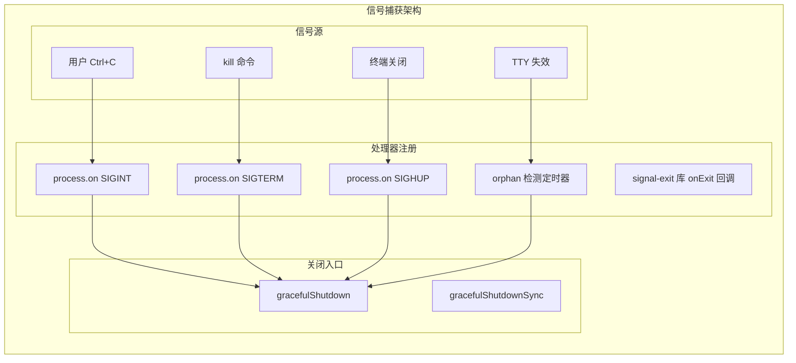
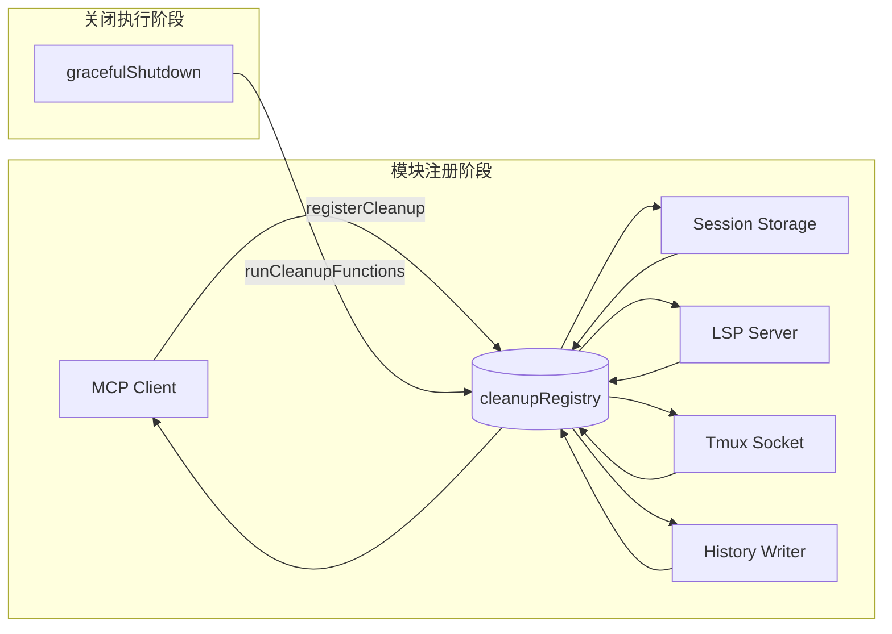
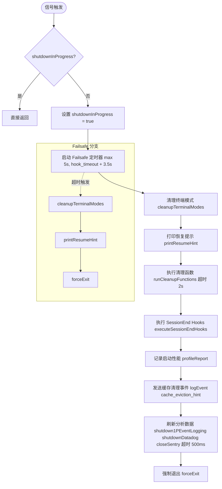
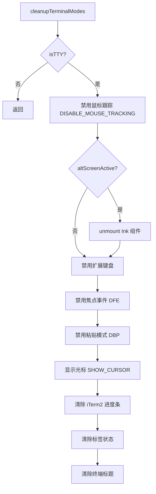
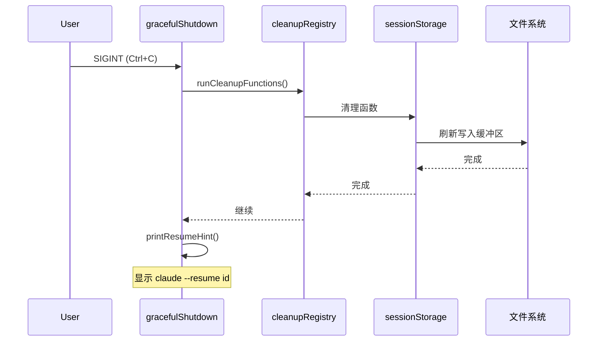
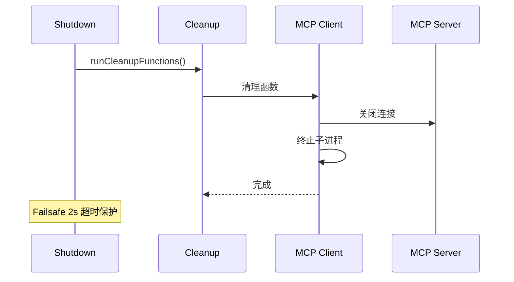

# 52 - 优雅关闭

> **代码入口**: `src/utils/gracefulShutdown.ts`
> **核心功能**: 信号处理、清理流程、资源释放、钩子管理

---

## 概述

优雅关闭是 Claude Code 进程生命周期的最后一道防线，确保进程终止时所有资源得到正确清理、用户数据得到持久化、终端状态得到恢复。它处理三种终止信号（SIGINT/SIGTERM/SIGHUP），并通过清理钩子机制协调各模块的资源释放。

### 设计理念

优雅关闭的核心目标是 **有序终止** — 即使在异常情况下（网络断开、终端关闭），也要保证：
1. 用户会话数据不丢失
2. 终端状态不残留（无乱码、无残留模式）
3. 外部资源正确释放（MCP连接、子进程等）

### 信号处理策略

| 信号 | 触发场景 | 退出码 | 处理策略 |
|-----|---------|-------|---------|
| SIGINT | Ctrl+C | 0 | 立即关闭，执行完整清理流程 |
| SIGTERM | kill 命令 | 143 (128+15) | 与 SIGINT 相同清理流程 |
| SIGHUP | 终端关闭 | 129 (128+1) | 与 SIGINT 相同清理流程 |
| Orphan | TTY 失效检测 | 129 | macOS 终端关闭时的兜底处理 |

---

## 设计原理

### 信号捕获机制

Claude Code 使用 `signal-exit` 库注册信号处理器，配合 Node.js 原生 `process.on()` 实现多层信号捕获：



**signal-exit Pin 机制** (`gracefulShutdown.ts:238-256`):

```typescript
// 防止 Bun 的 signal-exit bug
// 当 signal-exit v4 的最后一个订阅者取消订阅时，会调用 removeListener
// 这会重置内核的 sigaction，导致我们的 process.on(SIGTERM) 失效
// 解决方案：注册一个永不取消的 no-op 回调，保持 signal-exit 的订阅者计数 > 0
onExit(() => {})
```

### 清理钩子架构

清理钩子采用**注册-执行**分离模式，各模块注册自己的清理函数，关闭时统一执行：



---

## 实现原理

### 关闭流程总览



### 核心流程代码分析

**主关闭函数** (`gracefulShutdown.ts:392-524`):

```typescript
export async function gracefulShutdown(
  exitCode = 0,
  reason: ExitReason = other,
  options?: { ... }
): Promise<void> {
  // 1. 防止重复执行
  if (shutdownInProgress) return
  shutdownInProgress = true

  // 2. 获取 SessionEnd Hook 超时配置
  const sessionEndTimeoutMs = getSessionEndHookTimeoutMs()

  // 3. 启动 Failsafe 定时器（保底退出）
  failsafeTimer = setTimeout(
    code => {
      cleanupTerminalModes()
      printResumeHint()
      forceExit(code)
    },
    Math.max(5000, sessionEndTimeoutMs + 3500),  // 至少 5s
    exitCode,
  )

  // 4. 设置退出码
  process.exitCode = exitCode

  // 5. 清理终端模式（同步，优先级最高）
  cleanupTerminalModes()
  printResumeHint()

  // 6. 执行清理函数（超时 2s）
  await Promise.race([
    runCleanupFunctions(),
    new Promise((_, reject) => setTimeout(reject, 2000))
  ])

  // 7. 执行 SessionEnd Hooks
  await executeSessionEndHooks(reason, {
    signal: AbortSignal.timeout(sessionEndTimeoutMs),
    timeoutMs: sessionEndTimeoutMs,
  })

  // 8. 刷新分析数据（超时 500ms）
  await Promise.race([
    Promise.all([shutdown1PEventLogging(), shutdownDatadog(), closeSentry(2000)]),
    sleep(500),
  ])

  // 9. 强制退出
  forceExit(exitCode)
}
```

### 终端模式清理

终端清理必须在进程退出前完成，否则会留下残留状态（鼠标跟踪、备用屏幕等）：



**关键实现** (`gracefulShutdown.ts:60-137`):

```typescript
function cleanupTerminalModes(): void {
  if (!process.stdout.isTTY) return

  try {
    // 1. 禁用鼠标跟踪（优先，需要时间生效）
    writeSync(1, DISABLE_MOUSE_TRACKING)
    
    // 2. 退出备用屏幕
    const inst = instances.get(process.stdout)
    if (inst?.isAltScreenActive) {
      inst.unmount()  // Ink 组件卸载
    }
    
    // 3. 清理输入缓冲区
    inst?.drainStdin()
    inst?.detachForShutdown()
    
    // 4. 禁用所有终端模式
    writeSync(1, DISABLE_MODIFY_OTHER_KEYS)  // Kitty 键盘
    writeSync(1, DISABLE_KITTY_KEYBOARD)
    writeSync(1, DFE)    // 焦点事件
    writeSync(1, DBP)    // 粘贴模式
    writeSync(1, SHOW_CURSOR)
    writeSync(1, CLEAR_ITERM2_PROGRESS)
    
    // 5. 清除标签状态和标题
    if (supportsTabStatus()) writeSync(1, wrapForMultiplexer(CLEAR_TAB_STATUS))
    if (!isEnvTruthy(process.env.CLAUDE_CODE_DISABLE_TERMINAL_TITLE)) {
      writeSync(1, CLEAR_TERMINAL_TITLE)
    }
  } catch {
    // 终端可能已关闭，忽略写入错误
  }
}
```

### 孤儿进程检测

macOS 在终端关闭时会撤销 TTY 文件描述符而非发送 SIGHUP，需要定时检测：

```typescript
if (process.stdin.isTTY) {
  orphanCheckInterval = setInterval(() => {
    if (getIsScrollDraining()) return  // 滚动输出时跳过
    
    if (!process.stdout.writable || !process.stdin.readable) {
      clearInterval(orphanCheckInterval)
      void gracefulShutdown(129)
    }
  }, 30_000)  // 每 30 秒检测一次
  
  orphanCheckInterval.unref()  // 不阻止进程退出
}
```

---

## 功能展开

### 信号处理

#### SIGINT 处理

```typescript
process.on(SIGINT, () => {
  // Print 模式有自己的 SIGINT 处理器
  if (process.argv.includes(-p) || process.argv.includes(--print)) {
    return
  }
  
  logForDiagnosticsNoPII(info, shutdown_signal, { signal: SIGINT })
  void gracefulShutdown(0)
})
```

#### 多次中断处理

通过 `shutdownInProgress` 标志防止重复执行：

```typescript
let shutdownInProgress = false

export async function gracefulShutdown(...): Promise<void> {
  if (shutdownInProgress) return  // 第二次中断直接忽略
  shutdownInProgress = true
  // ...
}
```

### 清理流程

#### 清理函数注册

```typescript
// cleanupRegistry.ts
const cleanupFunctions = new Set<() => Promise<void>>()

export function registerCleanup(cleanupFn: () => Promise<void>): () => void {
  cleanupFunctions.add(cleanupFn)
  return () => cleanupFunctions.delete(cleanupFn)  // 返回取消注册函数
}

export async function runCleanupFunctions(): Promise<void> {
  await Promise.all(Array.from(cleanupFunctions).map(fn => fn()))
}
```

#### 典型清理函数

| 模块 | 清理内容 | 代码位置 |
|-----|---------|---------|
| MCP Client | 关闭连接、清理进程 | `services/mcp/client.ts:1576` |
| Session Storage | 刷新写入缓冲区 | `utils/sessionStorage.ts:449` |
| LSP Server | 停止语言服务器 | `entrypoints/init.ts:193` |
| Tmux Socket | 终止 tmux server | `utils/tmuxSocket.ts:314` |
| History Writer | 刷新历史记录 | `history.ts:421` |
| Telemetry | 关闭追踪会话 | `utils/telemetry/instrumentation.ts:561` |

### 资源释放

#### Failsafe 机制

```typescript
// 超时公式：max(5s, hook_timeout + 3.5s)
// 3.5s = 2s cleanup + 500ms analytics + 1s 缓冲
failsafeTimer = setTimeout(
  code => {
    cleanupTerminalModes()
    printResumeHint()
    forceExit(code)
  },
  Math.max(5000, sessionEndTimeoutMs + 3500),
  exitCode,
)
failsafeTimer.unref()  // 不阻止进程退出
```

#### 强制退出

```typescript
function forceExit(exitCode: number): never {
  // 清除 failsafe 定时器
  if (failsafeTimer !== undefined) {
    clearTimeout(failsafeTimer)
  }
  
  // 最后一次清理 stdin
  instances.get(process.stdout)?.drainStdin()
  
  try {
    process.exit(exitCode)
  } catch (e) {
    // process.exit() 可能抛出 EIO（终端已关闭）
    // 回退到 SIGKILL
    process.kill(process.pid, SIGKILL)
  }
}
```

### 钩子管理

#### SessionEnd Hook 执行

```typescript
export async function executeSessionEndHooks(
  reason: ExitReason,
  options?: { signal?: AbortSignal, timeoutMs?: number }
): Promise<void> {
  const hookInput = {
    ...createBaseHookInput(),
    hook_event_name: SessionEnd,
    reason,
  }
  
  await executeHooksOutsideREPL({
    hookInput,
    matchQuery: reason,
    signal,
    timeoutMs,
  })
  
  // 清理会话钩子
  clearSessionHooks(setAppState, sessionId)
}
```

#### Hook 超时配置

```typescript
// 默认 1.5s，可通过环境变量覆盖
const SESSION_END_HOOK_TIMEOUT_MS_DEFAULT = 1500

export function getSessionEndHookTimeoutMs(): number {
  const raw = process.env.CLAUDE_CODE_SESSIONEND_HOOKS_TIMEOUT_MS
  const parsed = raw ? parseInt(raw, 10) : NaN
  return Number.isFinite(parsed) && parsed > 0 ? parsed : SESSION_END_HOOK_TIMEOUT_MS_DEFAULT
}
```

---

## 核心数据结构

### 清理钩子接口

```typescript
// cleanupRegistry.ts
type CleanupFunction = () => Promise<void>

// 全局注册表
const cleanupFunctions = new Set<CleanupFunction>()

// 注册函数返回取消注册函数
type UnregisterFunction = () => void
```

### 信号处理器定义

```typescript
// 信号处理器配置
const signalHandlers = {
  SIGINT: { exitCode: 0, log: true },
  SIGTERM: { exitCode: 143, log: true },  // 128 + 15
  SIGHUP: { exitCode: 129, log: true },   // 128 + 1
}

// 孤儿检测配置
const orphanCheckConfig = {
  interval: 30_000,  // 30 秒
  skipDuringScrollDrain: true,
}
```

### 关闭状态

```typescript
// 全局关闭状态
let shutdownInProgress = false
let failsafeTimer: ReturnType<typeof setTimeout> | undefined
let orphanCheckInterval: ReturnType<typeof setInterval> | undefined
let pendingShutdown: Promise<void> | undefined

// 状态查询
export function isShuttingDown(): boolean {
  return shutdownInProgress
}

// 状态重置（仅测试使用）
export function resetShutdownState(): void {
  shutdownInProgress = false
  resumeHintPrinted = false
  if (failsafeTimer !== undefined) {
    clearTimeout(failsafeTimer)
    failsafeTimer = undefined
  }
  pendingShutdown = undefined
}
```

---

## 组合使用

### 与会话持久化协作



### 与网络管理协作



### 清理函数注册示例

```typescript
// MCP 客户端注册
const cleanupUnregister = registerCleanup(async () => {
  await client.close()
  if (childProcess) {
    childProcess.kill(SIGTERM)
  }
})

// 取消注册（模块卸载时）
cleanupUnregister()
```

---

## 小结

### 设计亮点

| 特性 | 实现方式 | 优势 |
|-----|---------|-----|
| 多层信号捕获 | signal-exit + process.on | 兼容 Bun/Node，防止信号丢失 |
| Pin 机制 | 永不取消的 onExit 回调 | 避免 Bun 的 removeListener bug |
| Failsafe 定时器 | setTimeout + unref | 保证即使清理挂起也能退出 |
| 清理钩子注册表 | Set + 返回取消函数 | 模块解耦，支持动态注册 |
| 终端模式清理 | writeSync 同步写入 | 确保退出前终端状态恢复 |

### 设计取舍

1. **清理超时 vs 完整性**
   - 选择：清理函数 2s 超时，分析数据 500ms 超时
   - 理由：用户体验优先，长时间等待不如快速退出

2. **同步 vs 异步清理**
   - 选择：终端模式同步清理，业务逻辑异步清理
   - 理由：终端状态恢复必须在进程退出前完成

3. **Failsafe 超时计算**
   - 选择：`max(5s, hook_timeout + 3.5s)`
   - 理由：平衡用户配置灵活性和退出保证

### 局限性

1. **清理顺序不可控**：所有清理函数并行执行，无法保证顺序
2. **无取消机制**：一旦关闭开始，无法中断或回滚
3. **调试困难**：同步终端清理无法记录详细日志

### 演进方向

1. **清理优先级**：支持高/中/低优先级清理函数
2. **进度反馈**：在清理过程中显示进度条
3. **状态持久化**：保存未完成操作，下次恢复时继续
