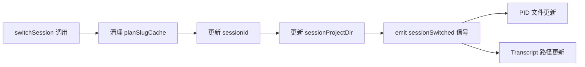
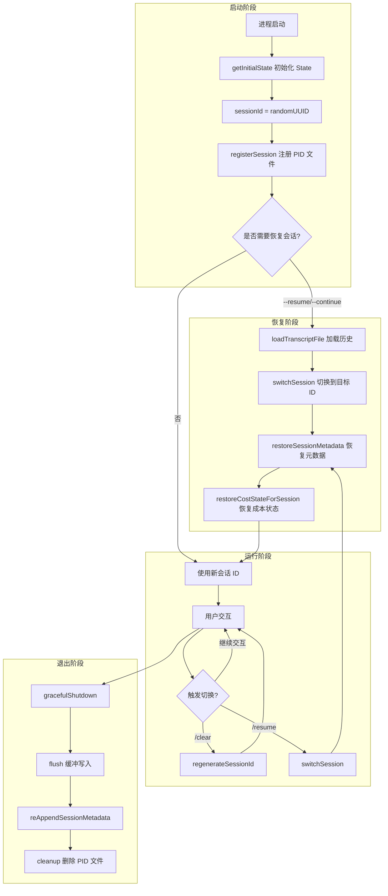
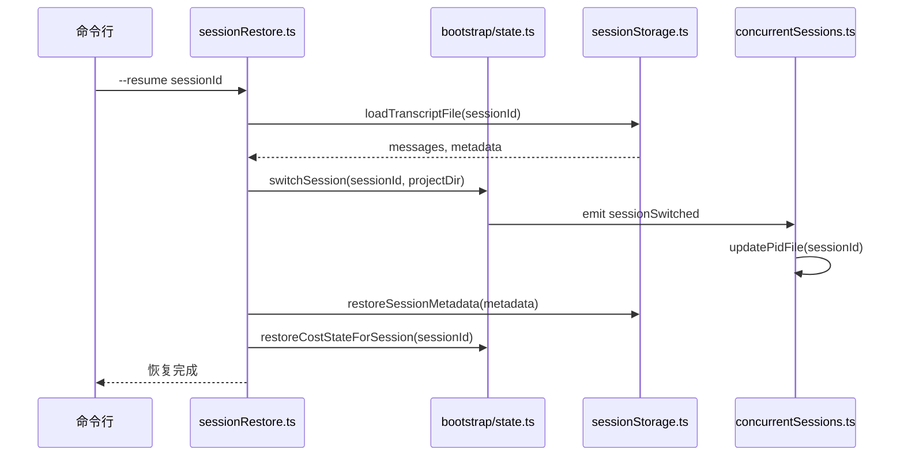

# 功能专题：并发会话管理

> 基于 `src/utils/concurrentSessions.ts` 与 `src/bootstrap/state.ts` 的代码证据分析

## 1. 概述

Claude Code 的并发会话管理实现了**多会话隔离**与**跨进程会话追踪**两大核心能力：

- **会话隔离**：每个会话拥有独立的 `sessionId`、`sessionProjectDir`、会话状态，支持在同一进程内安全切换会话
- **跨进程追踪**：通过 PID 文件注册机制，`claude ps` 可枚举所有活跃会话，实现多终端协作感知

设计理念：**原子性切换 + 延迟持久化 + 信号驱动同步**

## 2. 设计原理

### 2.1 会话 ID 管理

会话 ID 是会话的唯一标识，贯穿整个生命周期：

```
生成 → 使用 → 切换 → 恢复 → 追踪
```

**核心函数** (`src/bootstrap/state.ts:431-450`)：

| 函数 | 用途 | 触发场景 |
|------|------|----------|
| `getSessionId()` | 获取当前会话 ID | 所有需要会话标识的代码路径 |
| `regenerateSessionId()` | 生成新 ID，可选设置父会话 | `/clear` 清空上下文、进入 plan 模式 |
| `switchSession(id, projectDir)` | 原子切换会话 | `--resume`、`--continue`、`/resume` |
| `getParentSessionId()` | 获取父会话 ID | 追踪会话血缘关系（plan → 实现） |

**关键设计**：

1. **UUID 格式**：使用 `randomUUID()` 生成，类型为 `SessionId`（类型别名，底层为 UUID 字符串）
2. **血缘追踪**：`parentSessionId` 记录会话派生关系，支持 plan mode → implementation 的链路追踪
3. **Plan Slug 缓存清理**：切换会话时删除旧会话的 plan slug 缓存，避免 Map 无限增长

### 2.2 项目目录隔离

每个会话的 Transcript 文件存储位置由 `sessionId` + `sessionProjectDir` 共同决定：

```
~/.claude/projects/{sanitized-cwd}/{sessionId}.jsonl
```

**设计动机** (`src/bootstrap/state.ts:456-479`)：

- **跨项目恢复**：`--resume` 可能恢复位于不同 git worktree 或项目的会话
- **原子性保证**：`switchSession` 同时更新 `sessionId` 和 `sessionProjectDir`，防止两者漂移（CC-34）
- **默认值语义**：`sessionProjectDir = null` 表示从 `originalCwd` 派生路径

**路径解析逻辑** (`src/utils/sessionStorage.ts:202-225`)：

```typescript
export function getTranscriptPath(): string {
  const projectDir = getSessionProjectDir() ?? getProjectDir(getOriginalCwd())
  return join(projectDir, `${getSessionId()}.jsonl`)
}
```

### 2.3 状态原子性切换

会话切换时，必须保证多维度状态的**一致性**：



**信号机制** (`src/bootstrap/state.ts:481-489`)：

```typescript
const sessionSwitched = createSignal<[id: SessionId]>()
export const onSessionSwitch = sessionSwitched.subscribe
```

`concurrentSessions.ts` 订阅此信号，确保 PID 文件中的 `sessionId` 与当前会话同步：

```typescript
onSessionSwitch(id => {
  void updatePidFile({ sessionId: id })
})
```
## 3. 实现原理

### 3.1 会话生命周期流程



### 3.2 会话创建流程

**启动时初始化** (`src/bootstrap/state.ts:260-426`)：

1. `getInitialState()` 创建 State 对象
2. `sessionId` 初始化为 `randomUUID()`
3. `sessionProjectDir` 初始化为 `null`（从 `originalCwd` 派生）
4. `parentSessionId` 初始化为 `undefined`

**PID 文件注册** (`src/utils/concurrentSessions.ts:59-109`)：

- 跳过 teammate/subagent（避免污染 ps 输出）
- 注册退出清理回调
- 订阅会话切换信号，保持 PID 文件同步

### 3.3 会话切换流程

**恢复路径** (`src/utils/sessionRestore.ts:436-451`)：

```typescript
switchSession(
  asSessionId(sid),
  opts.transcriptPath ? dirname(opts.transcriptPath) : null,
)
await resetSessionFilePointer()
restoreCostStateForSession(sid)
```

**切换后同步** (`src/bootstrap/state.ts:468-479`)：

- 清理旧会话 planSlugCache
- 原子更新 sessionId + sessionProjectDir
- 触发 sessionSwitched 信号

### 3.4 会话恢复流程

**完整恢复链路** (`src/utils/sessionRestore.ts:409-550`)：

1. **加载 Transcript**：`loadTranscriptFile` 解析 `.jsonl` 文件
2. **切换会话**：`switchSession` 原子更新状态
3. **恢复元数据**：`restoreSessionMetadata` 恢复 title、tag、mode 等
4. **恢复成本状态**：`restoreCostStateForSession` 恢复累计 token/cost
5. **恢复 Worktree 状态**：`restoreWorktreeForResume` 恢复工作目录
6. **恢复 Agent 设置**：`restoreAgentFromSession` 恢复 agent 类型
## 4. 功能展开

### 4.1 会话生命周期管理

#### regenerateSessionId

**路径**：`src/bootstrap/state.ts:435-450`

**触发场景**：

| 场景 | `setCurrentAsParent` | 说明 |
|------|---------------------|------|
| `/clear` | `true` | 清空上下文但保留血缘追踪 |
| Plan mode 进入 | `true` | 记录 plan → 实现的派生关系 |
| `/compact` 后 | `false` | 压缩后创建新会话 ID |

#### switchSession

**路径**：`src/bootstrap/state.ts:468-479`

**关键约束**：

1. **原子性**：`sessionId` 和 `sessionProjectDir` 必须同时更新
2. **信号发射**：切换完成后发射 `sessionSwitched` 信号
3. **缓存清理**：删除旧会话的 `planSlugCache` 条目

#### onSessionSwitch 信号

**路径**：`src/bootstrap/state.ts:481-489`

**订阅者**：

- `concurrentSessions.ts`：同步 PID 文件中的 `sessionId`
- 未来可能扩展：metric 上报、telemetry 追踪等

### 4.2 会话隔离机制

#### sessionId + sessionProjectDir 双键设计

**问题背景**：`--resume` 可能恢复位于不同项目的会话

**解决方案**：`sessionProjectDir` 记录 Transcript 实际所在目录

#### parentSessionId 血缘追踪

**路径**：`src/bootstrap/state.ts:100-102`

**用途**：

1. **Plan mode 追踪**：plan 会话的 `parentSessionId` 指向原会话
2. **Telemetry 关联**：OTel tracing 使用 `parentSessionId` 作为 `parentAgentId`
3. **上下文继承**：子会话可访问父会话的上下文信息

### 4.3 会话持久化

#### Transcript 存储格式

**路径**：`~/.claude/projects/{sanitized-cwd}/{sessionId}.jsonl`

**存储内容**：

| Entry 类型 | 说明 | 持久化时机 |
|-----------|------|----------|
| `user` | 用户消息 | 每次用户输入 |
| `assistant` | 助手响应 | API 返回后 |
| `custom-title` | 自定义标题 | `/rename` 调用后 |
| `tag` | 会话标签 | `/tag` 调用后 |
| `last-prompt` | 最后提示词 | 每轮交互结束 |
| `worktree-state` | Worktree 状态 | 进入/退出 worktree |

#### 延迟持久化策略

**路径**：`src/utils/sessionStorage.ts:976-991`

**设计动机**：

- 避免创建只有元数据的空会话文件
- 用户可能立即退出，无需持久化

#### sessionPersistenceDisabled

**路径**：`src/bootstrap/state.ts:155, 1325-1331`

**触发场景**：

- `--no-session-persistence` 命令行参数
- `CLAUDE_CODE_SKIP_PROMPT_HISTORY` 环境变量
- `cleanupPeriodDays: 0` 设置
- 测试环境（默认禁用）

### 4.4 PID 文件管理

#### 会话注册

**路径**：`src/utils/concurrentSessions.ts:59-109`

**注册内容**：pid, sessionId, cwd, startedAt, kind, entrypoint, name, logPath, agent, messagingSocketPath, bridgeSessionId

#### 活跃会话枚举

**路径**：`src/utils/concurrentSessions.ts:168-203`

**清理策略**：

- 非活跃 PID 文件自动清理（WSL 除外，避免误删 Windows 进程）
- 严格文件名匹配（`^\d+\.json$`），防止误删用户文件
## 5. 核心数据结构

### 5.1 SessionState 接口

**路径**：`src/bootstrap/state.ts:45-257`

```typescript
type State = {
  // 会话标识
  sessionId: SessionId
  parentSessionId: SessionId | undefined
  sessionProjectDir: string | null
  
  // 项目路径
  originalCwd: string
  projectRoot: string
  cwd: string
  
  // 成本追踪
  totalCostUSD: number
  totalAPIDuration: number
  modelUsage: { [modelName: string]: ModelUsage }
  
  // 时间戳
  startTime: number
  lastInteractionTime: number
  
  // 会话级标志
  sessionPersistenceDisabled: boolean
  sessionTrustAccepted: boolean
  sessionBypassPermissionsMode: boolean
}
```

### 5.2 PID 文件结构

**路径**：`src/utils/concurrentSessions.ts:79-96`

```typescript
type PidFileEntry = {
  pid: number
  sessionId: string
  cwd: string
  startedAt: number
  kind: SessionKind
  entrypoint?: string
  name?: string
  logPath?: string
  agent?: string
  messagingSocketPath?: string
  bridgeSessionId?: string | null
}
```

### 5.3 SessionKind 类型

**路径**：`src/utils/concurrentSessions.ts:18`

```typescript
export type SessionKind = 'interactive' | 'bg' | 'daemon' | 'daemon-worker'
```

| Kind | 说明 | 启动方式 |
|------|------|----------|
| `interactive` | 交互式 CLI | 默认 |
| `bg` | 后台会话 | `claude --bg` |
| `daemon` | 守护进程 | 内部服务 |
| `daemon-worker` | 守护进程 worker | 内部服务 |

## 6. 组合使用

### 6.1 与会话恢复协作



### 6.2 与压缩系统协作

**压缩触发会话 ID 更新**：

- 压缩不保留血缘关系（`setCurrentAsParent: false`）
- 新会话继承压缩后的消息链
- PID 文件自动同步

## 7. 小结

### 设计取舍

| 决策 | 收益 | 代价 |
|------|------|------|
| 原子性切换 | 防止 sessionId/projectDir 漂移 | 无法单独更新任一字段 |
| 延迟持久化 | 避免空会话文件 | 首条消息前元数据仅内存 |
| 信号驱动同步 | 解耦订阅者 | 需显式注册回调 |
| PID 文件严格匹配 | 防止误删用户文件 | 需正则校验每个文件 |

### 局限性

1. **无 sessionId→projectDir 映射表**：切换到非当前会话只能猜测路径
2. **血缘关系单向**：只能从子会话追溯到父会话，无法反向
3. **PID 文件无锁**：并发写入可能导致竞态（实际概率极低）

### 演进方向

1. **会话注册表**：维护 sessionId→projectDir 的持久化映射
2. **血缘图**：支持双向遍历会话派生关系
3. **分布式会话**：跨机器会话同步（Remote Control 已部分实现）
