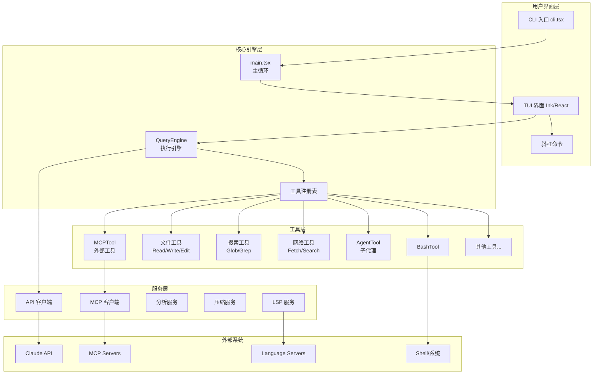
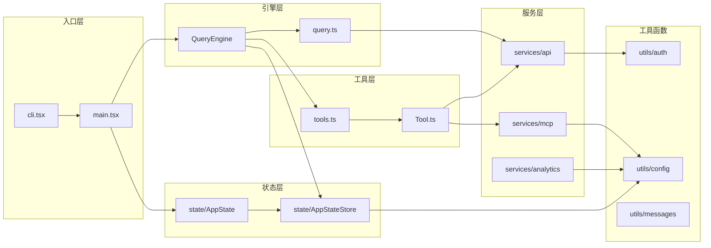

# Claude Code Best (CCB) 项目概览

## 1. 项目定位

### 系统核心职责
Claude Code Best 是 Anthropic 官方 Claude Code CLI 工具的逆向还原项目，提供终端中的交互式 AI 编程助手。系统通过多轮对话、工具调用、代码编辑等能力，帮助开发者完成软件工程任务。

### 解决的核心问题
- **交互式编程辅助**：在终端中与 Claude 模型进行自然语言对话，获取编程帮助
- **代码操作**：读取、编辑、写入文件，执行 Shell 命令
- **多模型支持**：支持 Claude 系列模型（Haiku/Sonnet/Opus）及第三方兼容 API
- **扩展能力**：通过 MCP（Model Context Protocol）协议接入外部工具和服务

### 技术栈与架构风格
- **运行时**：Bun >= 1.2.0
- **语言**：TypeScript + React（Ink TUI 框架）
- **架构风格**：事件驱动 + 状态管理 + 工具扩展模式
- **UI 框架**：Ink（React 终端渲染）
- **AI 接口**：Anthropic SDK / OpenAI 兼容 API
- **协议支持**：MCP（Model Context Protocol）、LSP（Language Server Protocol）

---

## 2. 目录导航

```
src/
├── entrypoints/           # 入口点
│   ├── cli.tsx           # CLI 主入口，路由分发
│   ├── init.ts           # 初始化逻辑
│   ├── mcp.ts            # MCP 服务入口
│   └── sdk/              # SDK 类型定义
├── main.tsx              # 主循环，Commander 命令解析
├── QueryEngine.ts        # 核心 Query 执行引擎
├── query.ts              # API 调用封装
├── tools.ts              # 工具注册表
├── Tool.ts               # 工具抽象基类与类型
├── commands.ts           # 斜杠命令注册表
├── tools/                # 工具实现（~56 个工具）
│   ├── BashTool/         # Shell 命令执行
│   ├── FileEditTool/     # 文件编辑
│   ├── FileReadTool/     # 文件读取
│   ├── FileWriteTool/    # 文件写入
│   ├── GlobTool/         # 文件模式匹配
│   ├── GrepTool/         # 内容搜索
│   ├── WebFetchTool/     # 网页抓取
│   ├── WebSearchTool/    # 网页搜索
│   ├── AgentTool/        # 子代理任务
│   ├── SkillTool/        # 技能调用
│   ├── MCPTool/          # MCP 工具调用
│   ├── LSPTool/          # LSP 诊断
│   ├── TodoWriteTool/    # 任务列表管理
│   ├── TaskCreateTool/   # 后台任务创建
│   └── ...               # 其他工具
├── commands/             # 斜杠命令实现（~100 个命令）
│   ├── login/            # 登录配置
│   ├── config/           # 设置管理
│   ├── model/            # 模型切换
│   ├── mcp/              # MCP 服务器管理
│   ├── hooks/            # Hook 配置
│   ├── permissions/      # 权限管理
│   ├── resume/           # 会话恢复
│   ├── compact/          # 对话压缩
│   └── ...               # 其他命令
├── services/             # 核心服务
│   ├── api/              # API 客户端
│   ├── mcp/              # MCP 客户端实现
│   ├── analytics/        # 分析埋点
│   ├── compact/          # 对话压缩服务
│   ├── autoDream/        # 自动记忆整理
│   ├── lsp/              # LSP 服务管理
│   └── ...               # 其他服务
├── utils/                # 工具函数（~350 个文件）
│   ├── auth.ts           # 认证逻辑
│   ├── config.ts         # 配置管理
│   ├── model/            # 模型相关
│   ├── permissions/      # 权限系统
│   ├── messages.ts       # 消息处理
│   ├── sessionStorage.ts # 会话存储
│   └── ...               # 其他工具
├── state/                # 全局状态管理
│   ├── AppStateStore.ts  # React 状态存储
│   └── AppState.tsx      # 状态 Provider
├── components/           # Ink UI 组件
├── hooks/                # React Hooks
├── context/              # React Context
├── bridge/               # 远程控制桥接
├── buddy/                # Buddy 辅助功能
├── coordinator/          # 协调器模式
├── assistant/            # Assistant 模式
├── skills/               # 技能系统
├── plugins/              # 插件系统
└── memdir/               # 记忆目录管理
```

---

## 3. 项目全景



---

## 4. 快速上手

### 核心入口文件
- **CLI 入口**：`src/entrypoints/cli.tsx` - 解析命令行参数，路由到不同执行路径
- **主循环**：`src/main.tsx` - Commander 命令解析，TUI 启动
- **执行引擎**：`src/QueryEngine.ts` - 核心对话循环，工具调用编排

### 主链路执行流程

```
用户输入
    │
    ▼
┌─────────────────┐
│  processUserInput │  解析用户输入，提取命令/文件引用
└────────┬────────┘
         │
         ▼
┌─────────────────┐
│   QueryEngine   │  构建消息历史，调用 API
└────────┬────────┘
         │
         ▼
┌─────────────────┐
│   Claude API    │  流式返回响应
└────────┬────────┘
         │
         ▼
┌─────────────────┐
│  工具调用检测    │  解析 tool_use 块
└────────┬────────┘
         │
    ┌────┴────┐
    ▼         ▼
┌──────┐ ┌──────────┐
│ 文本 │ │ 工具执行  │
│ 输出 │ │ Tool.run │
└──────┘ └────┬─────┘
              │
              ▼
       ┌─────────────┐
       │ 工具结果返回 │
       └──────┬──────┘
              │
              ▼
       ┌─────────────┐
       │ 下一轮对话  │
       └─────────────┘
```

### 关键配置说明
| 配置文件 | 说明 |
|---------|------|
| `~/.claude/settings.json` | 用户设置 |
| `~/.claude/auth.json` | 认证信息 |
| `.claude/settings.json` | 项目级设置 |
| `.mcp.json` / `.mcpServers.json` | MCP 服务器配置 |
| `CLAUDE.md` / `AGENTS.md` | 项目指令文件 |

---

## 5. 模块依赖图



---

## 6. 概念词典

| 术语 | 解释 |
|------|------|
| **Query** | 一次完整的对话请求，包含消息历史和工具调用 |
| **Tool** | Claude 可调用的能力单元，如 Bash、FileRead 等 |
| **MCP** | Model Context Protocol，模型上下文协议，用于接入外部工具 |
| **Compact** | 对话压缩，减少上下文长度以支持长对话 |
| **Agent** | 子代理，可独立执行任务的代理实例 |
| **Skill** | 技能，预定义的任务模板，如写小说、代码分析等 |
| **Bridge** | 远程控制桥接，允许远程访问本地环境 |
| **Buddy** | 辅助功能，提供额外的上下文和建议 |
| **Bypass Mode** | 权限绕过模式，自动批准所有工具调用 |
| **Auto Mode** | 自动模式，减少确认弹窗 |
| **Hook** | 钩子，在特定事件时执行的脚本 |
| **LSP** | Language Server Protocol，语言服务器协议 |
| **Telemetry** | 遥测，收集使用数据和错误报告 |
| **GrowthBook** | 功能开关服务，控制特性发布 |
| **Session** | 会话，一次完整的对话周期 |
| **Context Window** | 上下文窗口，模型可处理的最大 token 数 |
| **Thinking** | 思维链，模型的推理过程输出 |

---

## 7. 核心文件统计

| 类别 | 数量 | 说明 |
|------|------|------|
| 工具 (tools/) | ~56 | 可被 Claude 调用的能力 |
| 命令 (commands/) | ~100 | 斜杠命令实现 |
| 服务 (services/) | ~42 | 后台服务模块 |
| 工具函数 (utils/) | ~350 | 辅助函数和逻辑 |
| 组件 (components/) | ~150 | Ink UI 组件 |
| 总代码行数 | ~41,520 | TypeScript/TSX 文件 |
