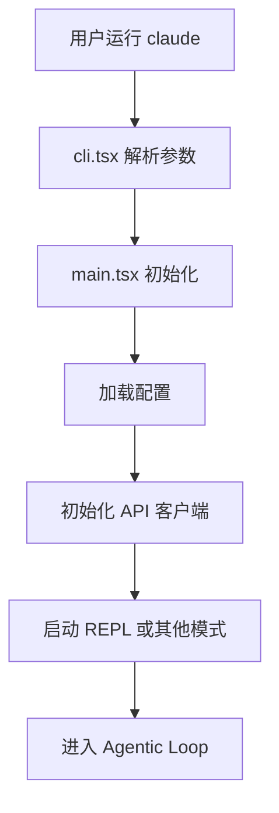
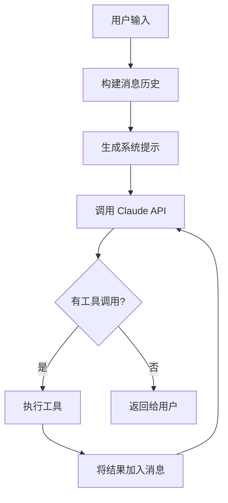

# Claude Code 学习地图

> 🎯 给学习者的架构导航，而不是机器的节点列表

## 🗺️ 快速导航

### 我想了解...

#### 1. 整体架构
- [[项目概览]] - 这是什么项目？技术栈是什么？
- [[架构模式]] - 模块化单体、事件驱动、REPL 模式
- [[运行流程]] - 从启动到执行的完整流程

#### 2. 核心机制
- [[Agentic Loop]] - 核心循环是如何工作的？
- [[Tool System]] - 工具是如何发现和执行的？
- [[Prompt System]] - 系统提示是如何构建的？

#### 3. 扩展能力
- [[MCP Integration]] - 如何集成外部工具服务器？
- [[Skill System]] - 如何编写自定义技能？
- [[Plugin System]] - 如何开发插件？

#### 4. 基础设施
- [[Core Utilities]] - 日志、配置、错误处理
- [[State Management]] - 应用状态如何管理？
- [[API Layer]] - 如何与 Claude API 通信？

## 📚 学习路径

### 路径1: 快速上手（1-2天）
```
项目概览 
  → 架构模式 
  → 运行流程 
  → Core Utilities
```
**适合**: 想快速了解项目结构的开发者

### 路径2: 深入理解（1周）
```
Agentic Loop 
  → Tool System 
  → Prompt System 
  → API Layer
```
**适合**: 想参与核心开发的贡献者

### 路径3: 扩展开发（3-5天）
```
MCP Integration 
  → Skill System 
  → Plugin System
```
**适合**: 想开发扩展的开发者

## 🏗️ 架构分层

```
┌─────────────────────────────────────────┐
│  👤 用户交互层                           │
│  - CLI 入口 (cli.tsx)                   │
│  - TUI 界面 (React + Ink)               │
│  - 命令系统 (commands.ts)               │
└─────────────────────────────────────────┘
              ↓
┌─────────────────────────────────────────┐
│  🔄 编排层                               │
│  - REPL 循环 (REPL.tsx)                 │
│  - Agentic Loop (query.ts)              │
│  - 状态管理 (AppState)                  │
└─────────────────────────────────────────┘
              ↓
┌─────────────────────────────────────────┐
│  🛠️ 能力层                              │
│  - 工具系统 (Tool abstraction)          │
│  - MCP 客户端 (外部工具集成)            │
│  - Skills (自定义技能)                  │
└─────────────────────────────────────────┘
              ↓
┌─────────────────────────────────────────┐
│  🌐 服务层                               │
│  - API 服务 (Claude/Bedrock/Vertex)     │
│  - 存储服务 (配置/缓存)                 │
│  - 监控服务 (日志/遥测)                 │
└─────────────────────────────────────────┘
              ↓
┌─────────────────────────────────────────┐
│  🏛️ 基础设施层                          │
│  - 日志 (debug.ts, log.ts)              │
│  - 配置 (config.ts)                     │
│  - 错误处理 (errors.ts)                 │
└─────────────────────────────────────────┘
```

## 🎯 核心概念卡片

### Agentic Loop（代理循环）
```
┌─────────────┐
│ 用户输入    │
└──────┬──────┘
       ↓
┌─────────────┐
│ 构建提示    │ ← Prompt System
└──────┬──────┘
       ↓
┌─────────────┐
│ 调用 LLM    │ ← API Layer
└──────┬──────┘
       ↓
┌─────────────┐
│ 解析响应    │
└──────┬──────┘
       ↓
┌─────────────┐
│ 执行工具    │ ← Tool System
└──────┬──────┘
       ↓
  是否完成？ ─否→ 回到"构建提示"
       │
       是
       ↓
┌─────────────┐
│ 返回结果    │
└─────────────┘
```

**关键文件**: `src/query.ts`

### Tool System（工具系统）
```
Tool (抽象基类)
  ├── FileReadTool - 读文件
  ├── FileWriteTool - 写文件
  ├── FileEditTool - 编辑文件
  ├── BashTool - 执行命令
  ├── GlobTool - 搜索文件
  ├── GrepTool - 搜索内容
  ├── WebFetchTool - 抓取网页
  ├── WebSearchTool - 搜索网络
  ├── AgentTool - 启动子代理
  ├── SkillTool - 执行技能
  └── MCP Tools - 外部工具
```

**设计模式**: 策略模式 + 工厂模式  
**关键文件**: `src/Tool.ts`, `src/tools.ts`

## 📖 核心流程详解

### 流程1: 启动流程


### 流程2: 请求处理流程


## 🔍 关键决策点

### 决策1: 为什么用 Bun 而不是 Node.js？
- ✅ 更快的启动速度
- ✅ 内置 TypeScript 支持
- ✅ 更好的 ESM 兼容性
- ❗ 但生态系统不如 Node.js 成熟

### 决策2: 为什么用 React + Ink 而不是原生 CLI？
- ✅ 组件化 UI 开发
- ✅ 状态管理更简单
- ✅ 响应式更新
- ❗ 但增加了学习曲线

### 决策3: 为什么设计 Tool 抽象？
- ✅ 统一的工具接口
- ✅ 易于添加新工具
- ✅ 支持权限控制
- ✅ 支持 MCP 扩展

## 🛠️ 实战练习

### 练习1: 添加一个新工具
**目标**: 实现 `TimeTool` 获取当前时间  
**涉及文件**: `src/tools/TimeTool.ts`  
**学习点**: Tool 接口、权限系统、提示词

### 练习2: 自定义 Skill
**目标**: 实现 `/translate` 技能  
**涉及文件**: `src/skills/translate.ts`  
**学习点**: Skill 接口、提示词模板

### 练习3: MCP 集成
**目标**: 连接一个外部 MCP 服务器  
**涉及文件**: `src/services/mcp/client.ts`  
**学习点**: MCP 协议、工具发现

## 📊 性能指标

| 模块 | 关键指标 | 目标值 |
|------|----------|--------|
| API 调用 | 首次响应时间 | <2s |
| 文件读取 | 缓存命中率 | >40% |
| 工具执行 | 平均耗时 | <500ms |
| 内存占用 | 峰值内存 | <200MB |

## 🔗 相关资源

### 官方文档
- [Claude API 文档](https://docs.anthropic.com)
- [MCP 协议规范](https://modelcontextprotocol.io)
- [Ink 文档](https://github.com/vadimdemedes/ink)

### 社区资源
- [[常见问题 FAQ]]
- [[最佳实践]]
- [[性能优化指南]]

---

**使用建议**: 
1. 先从"快速导航"找到感兴趣的主题
2. 跟随"学习路径"逐步深入
3. 通过"实战练习"巩固理解

**贡献指南**: 发现文档不清楚？欢迎提交 PR 补充！
